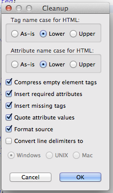

# Cleaning up the spec

1.  Up to date modifications
    1.  Use the <http://services.w3.org/htmldiff> service to check for
        (significant) changes that aren't yellow.
        1.  **Core:**
            [tr35.html](http://services.w3.org/htmldiff?doc1=http://unicode.org/reports/tr35/tr35.html&doc2=http://unicode.org/repos/cldr/trunk/specs/ldml/tr35.html)
        2.  **General:**
            [tr35-general.html](http://services.w3.org/htmldiff?doc1=http://unicode.org/reports/tr35/tr35-general.html&doc2=http://unicode.org/repos/cldr/trunk/specs/ldml/tr35-general.html)
        3.  **Numbers:**
            [tr35-numbers.html](http://services.w3.org/htmldiff?doc1=http://unicode.org/reports/tr35/tr35-numbers.html&doc2=http://unicode.org/repos/cldr/trunk/specs/ldml/tr35-numbers.html)
        4.  **Dates:**
            [tr35-dates.html](http://services.w3.org/htmldiff?doc1=http://unicode.org/reports/tr35/tr35-dates.html&doc2=http://unicode.org/repos/cldr/trunk/specs/ldml/tr35-dates.html)
        5.  **Collation:**
            [tr35-collation.html](http://services.w3.org/htmldiff?doc1=http://unicode.org/reports/tr35/tr35-collation.html&doc2=http://unicode.org/repos/cldr/trunk/specs/ldml/tr35-collation.html)
        6.  **Supplemental:**
            [tr35-info.html](http://services.w3.org/htmldiff?doc1=http://unicode.org/reports/tr35/tr35-info.html&doc2=http://unicode.org/repos/cldr/trunk/specs/ldml/tr35-info.html)
    2.  Review the yellow bits in each doc, and make sure they are reflected in
        the modifications section
        1.  [tr35.html#Modifications](http://www.unicode.org/repos/cldr/trunk/specs/ldml/tr35.html#Modifications)
    3.  Make sure that there is a bug number after each Modification (if
        feasible)
        1.  Use the trac report [Spec CURRENT
            Closed/Reviewing](http://unicode.org/cldr/trac/report/77)
        2.  Extract the ticket numbers, and past into a spreadsheet.
        3.  Grab the modifications, extract the ticket numbers and paste in
            second sheet.
        4.  Use =vlookup(B1,Sheet2!A:A,1,0) to see which are missing.
        5.  Then also check the lines in the spec for missing bug numbers
    4.  Review and check in.
2.  Clean up HTML
    1.  Select and open each file (with HTML editor) and choose Source>Cleanup
        Document…
        1.  Make sure the options look like the following the first time:
            
        2.  Click ok on each.
    2.  Select all of the spec/tr35 files in Eclipse (with Shift-Click), the
        Right-Click and choose Source>Format.
    3.  Review and check in.
3.  Run [CheckHtmlFiles](../tools/checkhtmlfiles.md) to figure out where the
    section numbers and TOC were misaligned. Sample results are below. For each
    file:
    1.  Fix all fatal errors (eg Missing Levels, eg where it hops from h3 to h5)
    2.  Check in, and rerun the tool
    3.  Look at the proposed REVISED TOC, see if the items are at the right
        level, fix them if not.
    4.  Check in, and rerun the tool
    5.  Fix the headers (under \*Errors\*). Typically the suggested line can
        replace the existing one, but should be reviewed.
    6.  Check in, and rerun the tool
    7.  Replace the TOC with the REVISED TOC
    8.  Review and check in.

Processing:     tr35-collation.html \*REVISED TOC\*             <ul class="toc">
<li>1 <a href="#CLDR_Collation">CLDR Collation</a></li>
<li>2 <a href="#Root_Collation">Root Collation</a>
<ul class="toc">                                        <li>2.1 <a
href="#grouping_classes_of_characters">Grouping classes of characters</a></li>
<li>2.2 <a href="#non_variable_symbols">Non-variable symbols</a></li>
<li>2.3 <a href="#tibetan_contractions">Additional contractions for
Tibetan</a></li>                                    <li>2.4 <a
href="#tailored_noncharacter_weights">Tailored noncharacter weights</a></li>
<li>2.5 <a href="#Root_Data_Files">Root Collation Data Files</a></li>
<li>2.6 <a href="#Root_Data_File_Formats">Root Collation Data File Formats</a>
<ul class="toc">
<li>2.6.1 <a href="#allkeys_CLDR_txt">allkeys_CLDR.txt</a></li>
<li>2.6.2 <a
href="#FractionalUCA_summary_txt">FractionalUCA_summary.txt</a></li>
<li>2.6.3 <a href="#FractionalUCA_txt">FractionalUCA.txt</a></li>
<li>2.6.4 <a href="#UCA_Rules_txt">UCA_Rules.txt</a></li>
<li>2.6.5 <a href="#UCA_Rules_xml">UCA_Rules.xml</a></li>
<li>2.6.6 <a href="#UCA_Rules_NoCE_txt">UCA_Rules_NoCE.txt</a></li>
</ul>                                   </li>                           </ul>
</li>                   <li>3 <a href="#Collation_Tailorings">Collation
Tailorings</a>                          <ul class="toc">
<li>3.1 <a href="#Collation_Version">Version</a></li>
<li>3.2 <a href="#Collation_Element">Collation Element</a></li>
<li>3.3 <a href="#Setting_Options">Setting Options</a></li>
<li>3.4 <a href="#Rules">Collation Rule Syntax</a></li>
<li>3.5 <a href="#Orderings">Orderings</a></li>
<li>3.6 <a href="#Contractions">Contractions</a></li>
<li>3.7 <a href="#Expansions">Expansions</a></li>
<li>3.8 <a href="#Context_Before">Context Before</a></li>
<li>3.9 <a href="#Placing_Characters_Before_Others">Placing Characters Before
Others</a></li>                                   <li>3.10 <a
href="#Logical_Reset_Positions">Logical Reset Positions</a></li>
<li>3.11 <a href="#Special_Purpose_Commands">Special-Purpose Commands</a></li>
<li>3.12 <a href="#Script_Reordering">Collation Reordering</a>
<ul class="toc">
<li>3.12.1 <a href="#Interpretation_of_a_reordering_list">Interpretation of a
reordering list</a></li>                                          </ul>
</li>                                   <li>3.13 <a href="#Case_Parameters">Case
Parameters</a></li>                                    <li>3.13 <a
href="#Untailored_Characters">Untailored Characters</a></li>
<li>3.13 <a href="#Compute_Modified_Collation_Elements">Compute Modified
Collation Elements</a></li>                                    <li>3.13 <a
href="#Tailored_Strings">Tailored Strings</a></li>
<li>3.14 <a href="#Visibility">Visibility</a></li>
<li>3.15 <a href="#Collation_Indexes">Collation Indexes</a>
<ul class="toc">
<li>3.15.1 <a href="#Index_Characters">Index Characters</a></li>
<li>3.15.2 <a href="#CJK_Index_Markers">CJK Index Markers</a></li>
</ul>                                   </li>                           </ul>
</li>           </ul> \*ERRORS\* <h3><a name="grouping_classes_of_characters"
href="#grouping_classes_of_characters">2.1 Grouping classes of
characters</a></h3>        <!-- Missing section numbers; --> <h3><a
name="non_variable_symbols" href="#non_variable_symbols">2.2 Non-variable
symbols</a></h3>     <!-- Missing section numbers; --> <h3><a
name="tibetan_contractions" href="#tibetan_contractions">2.3 Additional
contractions for Tibetan</a></h3>      <!-- Missing section numbers; --> <h3><a
name="tailored_noncharacter_weights" href="#tailored_noncharacter_weights">2.4
Tailored noncharacter weights</a></h3>  <!-- Missing section numbers; --> <h3><a
name="Root_Data_Files" href="#Root_Data_Files">2.5 Root Collation Data
Files</a></h3>  <!-- Section numbers mismatch, was 2.1; --> <h3><a
name="Root_Data_File_Formats" href="#Root_Data_File_Formats">2.6 Root Collation
Data File Formats</a></h3>   <!-- Section numbers mismatch, was 2.2; --> <h4><a
name="allkeys_CLDR_txt" href="#allkeys_CLDR_txt">2.6.1 allkeys_CLDR.txt</a></h4>
<!-- Missing section numbers; Missing double link--> <h4><a
name="FractionalUCA_summary_txt" href="#FractionalUCA_summary_txt">2.6.2
FractionalUCA_summary.txt</a></h4> <!-- Missing section numbers; Missing double
link--> <h4><a name="FractionalUCA_txt" href="#FractionalUCA_txt">2.6.3
FractionalUCA.txt</a></h4> <!-- Missing section numbers; Missing double link-->
<h4><a name="UCA_Rules_txt" href="#UCA_Rules_txt">2.6.4 UCA_Rules.txt</a></h4>
<!-- Missing section numbers; Missing double link--> <h4><a name="UCA_Rules_xml"
href="#UCA_Rules_xml">2.6.5 UCA_Rules.xml</a></h4>     <!-- Missing section
numbers; Missing double link--> <h4><a name="UCA_Rules_NoCE_txt"
href="#UCA_Rules_NoCE_txt">2.6.6 UCA_Rules_NoCE.txt</a></h4>      <!-- Missing
section numbers; Missing double link--> <h4><a
name="Interpretation_of_a_reordering_list"
href="#Interpretation_of_a_reordering_list">3.12.1 Interpretation of a
reordering list</a></h4>  <!-- Missing section numbers; Missing double link-->
<h5><a name="Untailored_Characters" href="#Untailored_Characters">3.13
Untailored Characters</a></h5>      <!-- Missing section numbers; Missing double
link--> Missing Level in: <h5><a name="Untailored_Characters"
href="#Untailored_Characters">3.13 Untailored Characters</a></h5> <h5><a
name="Compute_Modified_Collation_Elements"
href="#Compute_Modified_Collation_Elements">3.13 Compute Modified Collation
Elements</a></h5>    <!-- Missing section numbers; Missing double link-->
Missing Level in: <h5><a name="Compute_Modified_Collation_Elements"
href="#Compute_Modified_Collation_Elements">3.13 Compute Modified Collation
Elements</a></h5> <h5><a name="Tailored_Strings" href="#Tailored_Strings">3.13
Tailored Strings</a></h5>   <!-- Missing section numbers; Missing double link-->
Missing Level in: <h5><a name="Tailored_Strings" href="#Tailored_Strings">3.13
Tailored Strings</a></h5> <h4><a name="Index_Characters"
href="#Index_Characters">3.15.1 Index Characters</a></h4>  <!-- Missing section
numbers; Missing double link--> <h4><a name="CJK_Index_Markers"
href="#CJK_Index_Markers">3.15.2 CJK Index Markers</a></h4>        <!-- Missing
section numbers; Missing double link-->
