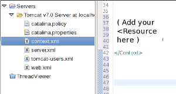

# SurveyTool Database configuration.

[TOC]

## *Note: this is detailed information most users (hopefully) won't need. Basic setup is covered in the [Step-By-Setup setup](../../setup.md).*

## JNDI

*   SurveyTool looks for "jdbc/SurveyTool" as a JNDI name. In the future, this
    will be the only configuration needed.
*   At start-up, the Survey Tool will create any tables needed.
*   You will be editing context.xml to add a **<Resource...>** element as
    described in the following sections. context.xml is either in your server's
    runtime directory, or in the following location if you are using Eclipse:

    

## Database Specific Instructions

### Automated Derby (easier to setup, but doesn' t support all SurveyTool features)

1.  Simply startup the Survey Tool without configuring the database. Right-click
    on "cldr-apps" and choose "Run on Server". Wait for the web page to load.
2.  An empty database will be created for you, and configuration information
    will be shown on the initial webpage. It will be an XML element starting
    with "<Resource …"
3.  Copy the entire `<Resource>…</Resource>` element into the <Context> element
    located in **context.xml** ( see previous section, JNDI. )
4.  Right-click the server and choose Restart.
5.  SurveyTool should start up normally.

### MySQL (production use, full featured)

1.  Set up [MySQL 5](http://dev.mysql.com/downloads/mysql/)
    1.  On Linux, use your distribution's package mannager. On Mac, use
        [homebrew](http://brew.sh)
    2.  Note: you **must** run 'mysql_secure_installation' or equivalent to set
        a root password, otherwise other access control settings will be
        silently ignored.
    3.  (Recommended: I like to use the "[MySQL
        workbench](http://dev.mysql.com/downloads/tools/)" GUI to administer
        mysql)
2.  Create a database (schema), for example '`cldrdb`', with the user, for
    example, '`usernam3`' with the password '`passw0rd`'
    1.  Ironically, the database should be created with **latin1 (latin1_bin)**
        codepage and encoding. *This is because full Unicode support was lacking
        when the SurveyTool was developed, and so binary blobs are used for
        Unicode data.*
3.  Download and install the [MySQL 5 Connector for
    J](http://dev.mysql.com/downloads/connector/j/5.0.html) into your tomcat's
    `lib/` directory (you don't need to build against it)
4.  **Note that the SurveyTool Setup tool has a "MySQL Configurator.." button at the last page. You can use this to generate the <Resource> element below.**
    **context.xml.**Set up the JNDI resource.You will need to add the following **<Resource ...** item to the server's
    If you are using Eclipse, you can find the context.xml in the "Servers"
    project, under "Tomcat v6.0 Server on Localhost" as "**context.xml**".
    Put the following near the end of the file, before the final "</Context>".
    Change the boldfaced parts as appropriate.

    <pre><code>&lt;Resource name="jdbc/SurveyTool"
                auth="Container"
                type="javax.sql.DataSource"
                username="<b>usernam3</b>"
                password="<b>passw0rd</b>"
                driverClassName="com.mysql.jdbc.Driver"
                url="jdbc:mysql://localhost:3306/<b>cldrdb</b>"
                maxActive="8"
                maxIdle="4"
    	removeAbandoned="true"
                removeAbandonedTimeout="60"
                        logAbandoned="true"
    			defaultAutoCommit="false"
    			poolPreparedStatements="true"
    			maxOpenPreparedStatements="150"
    			/&gt;
    </code></pre>
