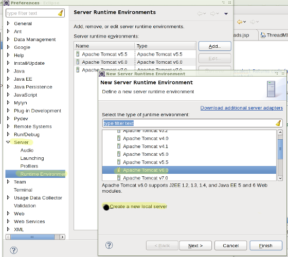

# Building and Running the Survey Tool on Eclipse

[TOC]

How to build and run the Survey Tool under Eclipse.

These instructions are under construction. Add comments below with any feedback
or questions.

These instructions assume you are checking out/building the trunk CLDR and
tools.

### Set up CLDR for Eclipse

*   See: [Eclipse Setup](../../eclipse-setup/index.md). Make sure you have
    "Eclipse for Java EE".
    Include the "cldr-apps" project when you import projects. It will import as
    a "Java EE" project.

### Initial Prerequisites

\[MD: added yellow here and below with recent notes as I updated.\]

#### Tomcat

Open tools/cldr-apps/.classpath and search for "Tomcat" to find out the version
you need, which we'll call XX in this description.

The SurveyTool is tested and deployed on Tomcat XX .

Download and unpack the latest Core distribution of Tomcat somewhere (use
directories without spaces in their name), but don't attempt to install or run
it- Eclipse will be launching it directly.

*   http://tomcat.apache.org/download-XX.cgi
*   =>
*   <myDirectory>apache-tomcat-XX

Next, bring up the **Server->Runtime Environments** preference section.. Add
your Tomcat runtime, and you can check "Create a New Local Server" now.

*Preferences > Server > Runtime Environments > Apache Tomcat XX >
<myDirectory>apache-tomcat-XX*

\[*Note that you will choose **Apache Tomcat vXX**, otherwise the picture below
is correct.\]*

Next set Server runtime:

*Preferences > Web Services > Server and Runtime > Tomcat XX Server.*

Do a clean build:

### *Project > Clean > Clean All Projects*

*Select org.unicode.cldr.unittest.web.TestAll*

*Run as > Java Application*

*it will fail*

*Run Configurations > TestAll*

*> Arguments > VM Arguments > -DCLDR_ENVIRONMENT=UNITTEST*

*> Main > Rename to TestAll cldr-apps*

*Run TestAll again.*

*you will get lots of System.err messages, but test should pass.*

### Building

At this point, the cldr-apps project should build successfully, without errors.

--> Congratulations. Now, proceed to [SurveyTool Step-by-step
setup](../setup.md).

---

Running cldr-apps any other time

*   Select the cldr-apps project and choose **Run** from the **Run** menu. (Or
    Debug if you want to.)
*   Double-click on Run on Server.

## Troubleshooting

### Unsupported Platforms

#### RAD 7.5

*   On RAD 7.5 I had to add the .jar files, explicitly, to the "Java EE Module
    Dependencies" page before the server would work.

#### WebSphere (instead of Tomcat)

*   On WAS7 there was a conflict between the ICU embedded in WAS7 (3.4.5?) and
    the latest one to be used. A missing symbol UnicodeSet.Freezable identifies
    this problem. Still unresolved.
