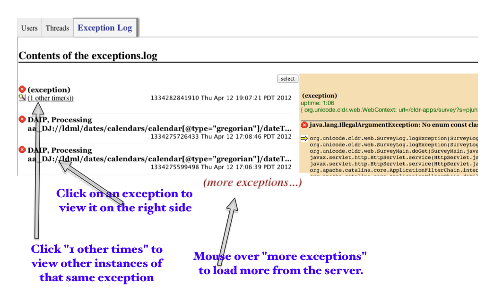

# STroubleshooting

## Things to Not Keep Rediscovering Each Time

### Debugging JavaScript issues (main views)

1.  click on the 'disconnected' panel. It will give some more information.
2.  bring up the javascript console (Tools menuor icon). See if there's any
    information there
3.  use stdebug to show more information in the javascript console
    1.  add to the URL: &stdebug=true&
    2.  Will show XPath in the detail box for an item.
    3.  Will show voting information in the detail box for Approved.
    4.  other?

### Viewing the SurveyTool exception table

1.  Log into the ST admin interface
2.  Click on Exception Log.

    {width="400" height="242"}

### Problem: crimson chokes on "UTF-8" as an encoding (?!!)

```none
java.lang.IllegalArgumentException: Can't read (anything).xml    line:    1
      ( in XMLFileReader )
Caused by: org.xml.sax.SAXParseException: Declared encoding "UTF-8" does not match actual one "UTF8"; this might not be an error.
    at org.apache.crimson.parser.Parser2.warning(Parser2.java:3342)
    at org.apache.crimson.parser.Parser2.readEncoding(Parser2.java:3140)
    at org.apache.crimson.parser.Parser2.maybeXmlDecl(Parser2.java:1190)
    at org.apache.crimson.parser.Parser2.parseInternal(Parser2.java:653)
    at org.apache.crimson.parser.Parser2.parse(Parser2.java:337)
    at org.apache.crimson.parser.XMLReaderImpl.parse(XMLReaderImpl.java:448)
    at org.unicode.cldr.util.XMLFileReader.read(XMLFileReader.java:97)
    ... 30 more
```

Solution: `-DCLDR_DEFAULT_SAX_PARSER=org.apache.xerces.parsers.SAXParser`
