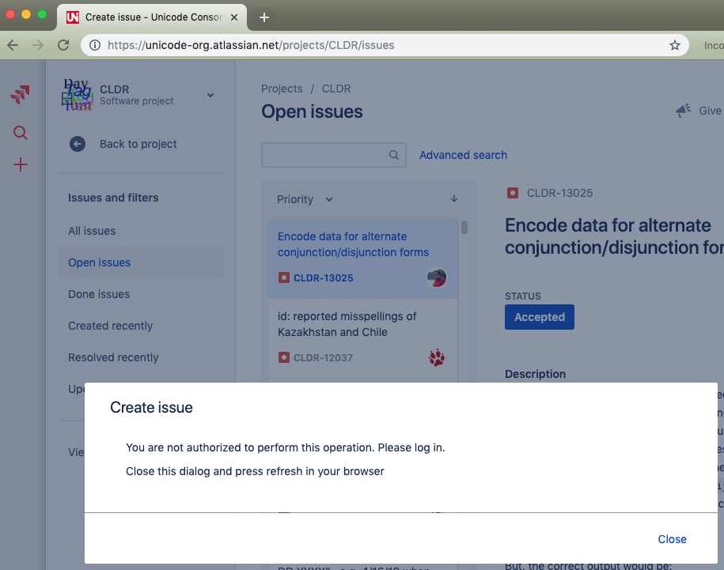

# CLDR Change Requests

## Requesting Changes

There are two ways to request changes (for bug fixes or new features):

### Use the CLDR Survey Tool

*   **fixing/adding most language-specific data**
*   ***for more information (including opening an account), see **[Survey
    Tool](../survey-tool/index.md).*****

### [File a Ticket](index.md)

*   additions of new locales (see [Adding New Locales](index.md))
*   defects in the survey tool
*   adding or changing non-language data (such as currency usage)
*   additions or changes to data that is not yet handled by the survey tool
    (collation, segmentation, and transliteration)
*   feature requests in CLDR or [UTS #35: Locale Data Markup Language
    (LDML)](http://www.unicode.org/reports/tr35/).

## Filing a Ticket

The CLDR tickets are located at:
<https://unicode-org.atlassian.net/projects/CLDR/>.

To file a ticket, hit the large ➕ on the left side. If you don't have an
account, you'll see an image like the following.

{width="400" height="315"}

If you see that dialog, please sign up for [a Jira
account](https://id.atlassian.com/signup?continue=https%3A%2F%2Funicode-org.atlassian.net%2Flogin%3FredirectCount%3D1%26dest-url%3Dhttps%253A%252F%252Funicode-org.atlassian.net%252Fprojects%252FCLDR%252Fissues&application=jira).

In CLDR Bug Reports, please try to give as much information as possible to help
address the issue, and please group related bugs (such as a list of problems
with the LDML specification) into a single bug report.

A few areas are particularly tricky.

*   For the sort order of a language, see [Collation
    Guidelines](../cldr-spec/collation-guidelines.md)
*   For plural rules (ordinals and cardinals), see [Plural
    Rules](../cldr-spec/plural-rules.md)

## Adding New Locales

If you would like to add data for a *new* locale, please **[File a
Ticket](http://unicode.org/cldr/trac/newticket)** requesting the addition. You
should also notify your CLDR contact (see [Survey Tool
Accounts](../survey-tool/accounts.md)).

*   Make sure that you pick the right locale code for the new data. See [Picking
    the Right Language Code](../cldr-spec/picking-the-right-language-code.md)
*   A new locale is only added if someone commits to supplying [Core Data for
    New Locales](../cldr-spec/minimaldata/index.md).
*   In special cases, XML files in LDML format can be supplied. See [Bulk Data
    Upload](../survey-tool/upload/index.md).
