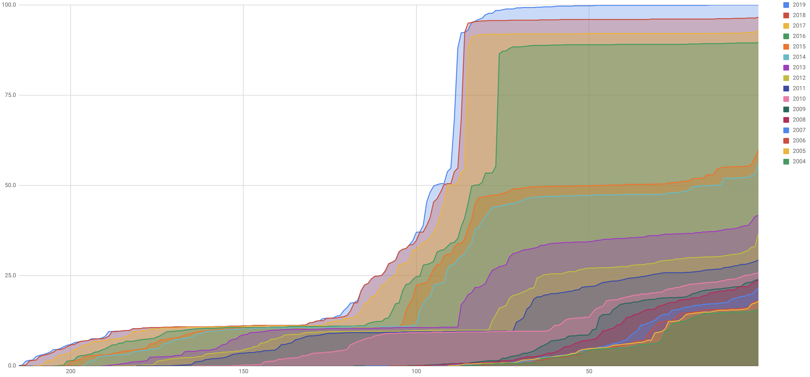

# CLDR 35 Release Note

No. Date Rel. Note Data Charts Spec Delta Tickets SVN Tag **DTD Δs** 35.1
2019-04-17 [v35.1](index.md) [CLDR35.1](http://unicode.org/Public/cldr/35.1/)
[Charts35.1](http://www.unicode.org/cldr/charts/35/)
[LDML35](https://www.unicode.org/reports/tr35/tr35-55/tr35.html)
[Δ35.1](http://unicode.org/cldr/trac/query?resolution=fixed&milestone=35.1&group=component&max=999)
[`release-35-1`](http://www.unicode.org/repos/cldr/tags/release-35-1/) [
ΔDtd35](http://www.unicode.org/cldr/charts/35/supplemental/dtd_deltas.html) 35
2019-03-27 [v35](http://cldr.unicode.org/index/downloads/cldr-35)
[CLDR35](http://unicode.org/Public/cldr/35/)
[Charts35.1](http://www.unicode.org/cldr/charts/35/)
[LDML35](https://www.unicode.org/reports/tr35/tr35-55/tr35.html)
[Δ35](http://unicode.org/cldr/trac/query?resolution=fixed&milestone=35&group=component&max=999)
[`release-35`](http://www.unicode.org/repos/cldr/tags/release-35/)
[ΔDtd35](http://www.unicode.org/cldr/charts/35/supplemental/dtd_deltas.html)

## Overview

Unicode CLDR 35 provides an update to the key building blocks for software
supporting the world's languages. CLDR data is used by all [major software
systems](http://cldr.unicode.org/index#TOC-Who-uses-CLDR-) for their software
internationalization and localization, adapting software to the conventions of
different languages for such common software tasks.

CLDR 35 included a [limited Survey Tool data collection
phase](https://www.unicode.org/cldr/charts/35/supplemental/locale_coverage.html).
The following summarizes the changes in the release.

**Data** 70,000+ new data fields, 13,400+ revised data fields **Basic coverage**
New languages at **Basic** coverage: Cebuano (ceb), Hausa (ha), Igbo (ig),
Yoruba (yo) **Modern coverage** Languages Somali (so) and Javanese (jv)
increased coverage from **Moderate** to **Modern** **Emoji 12.0** Names and
annotations (search keywords) for [90+ new
emoji](http://blog.unicode.org/2019/02/unicode-emoji-12-final-for-2019.html);
Also includes fixes for previous names & keywords **Collation** Collation
updated to **Unicode 12.0**, including new emoji;
Japanese single-character (ligature) era names added to collation and search
collation **Measurement units** 23 additional
[units](http://www.unicode.org/cldr/charts/35/delta/supplemental-data.html#unit)
**Date formats** Two additional flexible formats, and 20 new interval formats
**Japanese calendar** In Japanese locale, updated to use Gannen (元年) year
numbering for non-numeric formats (which include 年); also more consistent use of
narrow eras in numeric date formats such as “H31/3/27”. **Region Names** Many
names updated to local equivalents of “North Macedonia”
([MK](https://www.unicode.org/cldr/charts/35/by_type/locale_display_names.territories__europe_.html#216cb1286c47a733))
and “Eswatini”
([SZ](https://www.unicode.org/cldr/charts/35/by_type/locale_display_names.territories__africa_.html#6e49aa3c9aa50dc9)).
**Segmentation** Enhanced Grapheme Cluster Boundary rules for 6 Indic scripts:
Gujr, Telu, Mlym, Orya, Beng, Deva.

A dot release, version 35.1 is expected in April, with further changes for
Japanese calendar.

For details, see [Detailed Specification Changes](index.md), [Detailed Structure
Changes](index.md), [Detailed Data Changes](index.md).

## Detailed Specification Changes

Aside from documenting additional structure, there have been important
modifications to the following areas of LDML:

Part 1: Core

*   Section 3 [Unicode Language and Locale
    Identifiers](https://www.unicode.org/reports/tr35/tr35-55/tr35.html#Identifiers)
*   Section 4.4 [Language
    Matching](https://www.unicode.org/reports/tr35/tr35-55/tr35.html#LanguageMatching)
*   Section 5.5 [Valid Attribute
    Values](https://www.unicode.org/reports/tr35/tr35-55/tr35.html#Valid_Attribute_Values)
*   Section 5.7 [DTD
    Annotations](https://www.unicode.org/reports/tr35/tr35-55/tr35.html#DTD_Annotations)
*   Section 6.4 [Segmentation
    Tests](https://www.unicode.org/reports/tr35/tr35-55/tr35.html#Segmentation_Tests)

Part 2: General

*   Section 1 [Display Name
    Elements](https://www.unicode.org/reports/tr35/tr35-55/tr35-general.html#Display_Name_Elements)
*   Section 6 [Unit
    Elements](https://www.unicode.org/reports/tr35/tr35-55/tr35-general.html#Unit_Elements)

Part 4: Dates

*   Section 2.6.2 [Elements availableFormats,
    appendItems](https://www.unicode.org/reports/tr35/tr35-55/tr35-dates.html#availableFormats_appendItems)

For more detailed specification changes, see [LDML35
Modifications](https://www.unicode.org/reports/tr35/tr35-55/tr35.html#Modifications).

## Detailed Structure Changes

No DTD changes, except for the following:

**XML metadata** DTDs now have enhanced syntax for valid attribute values

## Detailed Data Changes

In addition, the following changes were made. This is not complete: for a full
list see the [list of bug
fixes](http://unicode.org/cldr/trac/query?resolution=fixed&milestone=35&group=component&max=999).

**[BCP47 IDs](https://www.unicode.org/cldr/charts/35/delta/bcp47.html)**
Transliteration methods ewts (Extended Wylie) and iast (Int’l Alphabet of
Sanskrit);
timezones kzksn (= Qostanay) and utce13;
numbering systems jpanyear and hmnp (Nyiakeng Puachue Hmong).
**[Validity](https://www.unicode.org/cldr/charts/35/delta/supplemental-data.html#IdValidity)**
Deprecated various languages and 3 variants for consistency with BCP47;
deprecated currency UYW;
new category of *reserved* for matching the spec. **Language matching** Four new
paradigm locales: en_GB, es_419, pt_BR, pt_PT
**Plural rules** Cebuano (ceb) \[new\];
mo, mr, ro \[minor changes; no new categories\];
kw \[major changes, new categories\] **Time** Hour preferences: ar_001, en_001,
hi_IN; PY, SM, it, various es sublocales.
Day periods: Farsi (fa) major revamp **Segmentation** The new rules for Indic
languages are in common/properties/segments:
• readme.txt (with the rule changes)
• GraphemeBreakTest-12.0.0mod.txt
• GraphemeBreakTest-12.0.0mod.html
Test files are in … cldr/unittest/data/graphemeCluster **New locales** in
common: ceb, ceb_PH, en_AE, ps_PK;
moved from seed to common: ku, ku_TR, xh, xh_ZA

## Growth

The following chart shows the growth of CLDR data over time. It counts the
number of data items in **/main** and **/annotations** directories, keyed by
locale.

The chart does not include data in the **/annotationsDerived, /bcp47, /casing,
/collation, /dtd, /keyboards, /properties, /rbnf, /segments, /subdivisions,
/supplemental, /transforms, /uca,** and **/validity** directories, which is
roughly twice as much appears in the above chart.

The chart includes the latest release for each year. The latest data for 2019
will only be available in October; v35.0 just had a limited Survey Tool data
collection phase as described in the [Overview](index.md).

## Migration

1.  Plural changes (unlikely to cause migration problems).
    1.  Marathi (mr) changed the category for 0 to *other*.
    2.  Cornish (kw) added 3 categories and changed many assignments.
2.  Hindi (hi) changed to English AM/PM strings from translations.
3.  The mapping for deprecated language code “mo” has changed from “ro_MD” to
    just “ro”.

## V35.1

The v35.1 dot-release is focused on the new Japanese era. It includes the
following tickets:

[#11796](https://unicode.org/cldr/trac/ticket/11796) [Japanese new era work with
the actual name](https://unicode.org/cldr/trac/ticket/11796)
[#11969](https://unicode.org/cldr/trac/ticket/11969) [Japan new era localized
names in non-Latin script locales other than
ja](https://unicode.org/cldr/trac/ticket/11969)
[#11970](https://unicode.org/cldr/trac/ticket/11970) [Update ja collation to add
square era symbol for new Japan era](https://unicode.org/cldr/trac/ticket/11970)
[#11978](https://unicode.org/cldr/trac/ticket/11978) [Unicode
12.1](https://unicode.org/cldr/trac/ticket/11978)
[#11967](https://unicode.org/cldr/trac/ticket/11967) [tzdata2019a
update](https://unicode.org/cldr/trac/ticket/11967)
[#11972](https://unicode.org/cldr/trac/ticket/11972) [assertion error for
"Vanguard section, for zic and other parsers that support negative DST"
\[regression issue introduced by
#11967](https://unicode.org/cldr/trac/ticket/11972) \]
[#11860](https://unicode.org/cldr/trac/ticket/11860) [North Macedonia
translations](https://unicode.org/cldr/trac/ticket/11860)
[#11901](https://unicode.org/cldr/trac/ticket/11901) [Sindhi (sd) should have
harakat in its exemplar](https://unicode.org/cldr/trac/ticket/11901)
[#11991](https://unicode.org/cldr/trac/ticket/11991) [Latest v35.1
charts](https://unicode.org/cldr/trac/ticket/11991)

## Known Issues

1.  Ticket [#12008](https://unicode.org/cldr/trac/ticket/12008): For v36, the
    data for testing Indic grapheme clusters (plus other test data) is moving
    into common: see
    [testData/segmentation/graphemeCluster/](https://www.unicode.org/repos/cldr/trunk/common/testData/segmentation/graphemeCluster/)
    for a preview.
2.  The v35.1 [Verification
    charts](https://www.unicode.org/cldr/charts/35/verify/index.html) are still
    draft.
3.  The v35.1 Transform charts are temporarily disabled.

## Acknowledgments

Many people have made significant contributions to CLDR and LDML; see the
[Acknowledgments](../../acknowledgments.md) page for a full listing.

## Key to Header Links

Rel. Note a general description of the contents of the release, and any relevant
notes about the release Data a set of zip files containing the contents of the
release (the files are complete in themselves, and do not require files from
earlier releases -- for the structure of the zip file, see [Repository
Organization](http://cldr.unicode.org/index/downloads#Repository_Organization))
Charts a set of charts showing some of the data in the release. Spec the version
of [UTS #35: LDML](http://www.unicode.org/reports/tr35/) that corresponds to the
release Delta a list of all the bug fixes and features in the release, which be
used to get the precise corresponding file changes using
[BugDiffs](http://unicode.org/cgi-bin/bugdiffs.pl) SVN Tag the files in the
release, accessible via via [Repository
Access](http://cldr.unicode.org/index/downloads#latest_draft_version). *For more
details see [CLDR Releases (Downloads)](../index.md)* DTD Diffs a diff of the
DTD source files DTD Δs a link pointing to a charts of changes in the DTDs over
time.

---

The Unicode [Terms of Use](http://unicode.org/copyright.html) apply to CLDR
data; in particular, see [Exhibit
1](http://unicode.org/copyright.html#Exhibit1).

For web pages with different views of CLDR data, see
<http://cldr.unicode.org/index/charts>.
