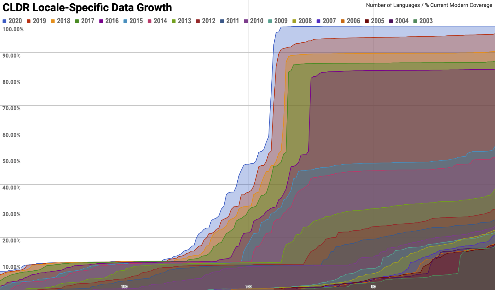

# CLDR 37 Release Note

No. Date Rel. Note Data Charts Spec Delta Tickets GitHub Tag Delta DTD 37
2020-04-23 [v37](http://cldr.unicode.org/index/downloads/cldr-37)
[CLDR37](http://unicode.org/Public/cldr/37/)
[Charts37](https://unicode-org.github.io/cldr-staging/charts/37/)
[LDML37](http://www.unicode.org/reports/tr35/tr35-59/tr35.html)
[Δ37](https://unicode-org.atlassian.net/issues/?jql=project%20%3D%20CLDR%20AND%20status%20%3D%20Done%20AND%20resolution%20%3D%20Fixed%20AND%20fixVersion%20%3D%20%2237%22%20ORDER%20BY%20component%20ASC%2C%20priority%20DESC%2C%20created%20ASC)
[release-37](https://github.com/unicode-org/cldr/tree/release-37)
[ΔDtd37](https://unicode-org.github.io/cldr-staging/charts/37/supplemental/dtd_deltas.html)

*See [Key to Header Links](../index.md)*

## Overview

Unicode CLDR provides an update to the key building blocks for software
supporting the world's languages. CLDR data is used by all [major software
systems](http://cldr.unicode.org/index#TOC-Who-uses-CLDR-) (including all mobile
phones) for their software internationalization and localization, adapting
software to the conventions of different languages.

CLDR v37 focuses on adding new locales, enhancing support for units of
measurement, adding annotations (names and search keywords) for symbols, and
adding annotations for Emoji v13.

## Data Changes

*   **Units**
    *   **Expanded locale preferences for units of measurement.** The new unit
        preference and conversion data allows formatting functions to pick the
        right measurement units for the locale and usage, and convert input
        measurement into those units. See additional details in [Specification
        Changes](index.md).
    *   **SI Prefixes**. SI prefix patterns for *"kilo{0}", "mega{0}"*, etc.
        have been added, as well as the prefix terms for *square* and *cubic*.
        These are fallbacks for when no combined form is available, so that the
        name for more unusual units like *megagram* or *square megameter* can be
        formed in different languages.
    *   **Other additions**. A few unit identifiers translations been added,
        such as duration-century, area-square-kilometer, area-square-meter.
    *   *See also [Migration](index.md).*
*   **Annotations**
    *   **Emoji 13.0.** The emoji annotations (names and search keywords) for
        the new Unicode 13.0 emoji are added.
    *   **Annotations (names and keywords) expanded to cover more than emoji.**
        This release includes a small set of Unicode symbols (arrow, math,
        punctuation, currency, alphanumerics, and geometric) with more to be
        added in future releases. For example, see
        [v37/annotations/romance.html](https://unicode.org/cldr/charts/37/annotations/romance.html#%E2%80%93).
*   **Sorting**
    *   **Emoji 13.0.** The collation sequences are updated for new Unicode 13.0
        and for Emoji 13.0.
*   **Locales**
    *   New languages at **Basic** coverage: **Fulah (Adlam), Maithili,
        Manipuri, Santali, Sindhi (Devanagari), Sundanese**
    *   New languages at **Modern** coverage: **Nigerian Pidgin**
    *   See [Locale Coverage
        Data](https://www.unicode.org/repos/cldr-aux/charts/37/supplemental/locale_coverage.html)
        for the coverage per locale, for both new and old locales.
*   **Grammatical data**
    *   **Grammatical features added**. Grammatical features are added for many
        languages, a first step to allowing programmers to format units
        according to grammatical context (eg, the dative version of "3
        kilometers").
*   **Misc**
    *   **Updates to code sets.** In particular, the EU is updated (removing
        GB).
    *   **Alternate versions.** In some languages
        *   Some additional language names have "menu" style for alphabetizing,
            such as *Kurdish, Central* instead of *Central Kurdish*.
        *   There are variants for *Cape Verde* as equivalent to *Cabo Verde*.
    *   **Myanmar-Latin transliteration** added

For access to the data, see the **GitHub tag** above. For more details see the
**Delta Tickets** above.

## Specification Changes

The largest changes were the following:

*   **Expanded locale preferences for units of measurement.** The new unit
    preference and conversion data allows formatting functions to pick the right
    measurement units for the locale and usage, and convert input measurement
    into those units.
    *   For example, a program (or database) could use 1.88 meters internally,
        but then for person-height have that measurement convert to 6 foot 2
        inches for en_US and to 188 centimeters for de_CH.
    *   Using the unit display names and list formats, those results can then be
        displayed according to the desired width (eg 2″ vs 2 in vs *2 inches*)
        and using the locale display names and number formats.
    *   The size of the measurement can also be taken into account, so that an
        infant can have a height as 18 inches, and an adult the height as 6 foot
        2 inches.
*   ***Grammatical features added**. Grammatical features are added for many
    languages.*
*   **List Patterns.** Clarified that more sophisticated processing can be used,
    and added examples of customized processing for specific languages.

For more detailed specification changes, see the **Spec** above, and look at the
**Modifications** section.

## Structure Changes

*   New elements are added for enhanced unit preferences, such as the units to
    use for person-height in different countries. This is an initial phase;
    additional preferences will be added in the future.
*   Additionally, elements and data are added for unit conversions, so that
    programmers can supply amounts in one unit and get the right amounts to
    display for different locales.
*   Grammatical features are added for various languages, as a prelude to
    allowing programmers to format units according to grammatical context (eg,
    dative version of 3 kilometers)
*   The augmented constraints have been updated, so that the tests can apply
    those constraints to all of the CLDR data.
*   Annotations now include non-emoji. Note: emoji are distinguished from other
    symbols using [Unicode
    properties](https://unicode.org/cldr/utility/unicodeset.jsp?a=%5Cp%7bemoji%7d&b=%5Cp%7bSymbol%7d&abb=tru).

For more information, see the **Delta DTDs** above.

**Chart Changes**

*   All charts are updated to reflect the v37 data updates.
*   New charts added: [Unit
    Conversions](https://www.unicode.org/repos/cldr-aux/charts/37/supplemental/unit_conversions.html)
    and [Unit
    Preferences](https://www.unicode.org/repos/cldr-aux/charts/37/supplemental/unit_preferences.html)
*   Charts with large number of changes:
    *   [Territory
        Subdivision](https://www.unicode.org/repos/cldr-aux/charts/37/supplemental/territory_subdivisions.html)
    *   [Delta
        Charts](https://www.unicode.org/repos/cldr-aux/charts/37/delta/index.html)
    *   [Annotations
        Charts](https://www.unicode.org/repos/cldr-aux/charts/37/annotations/index.html)

## Growth

The following chart shows the growth of CLDR locale-specific data over time. It
does not include the non-locale specific data, nor locale-specific data that is
not collected via the Survey Tool. It is thus restricted to data items in
**/main** and **/annotations** directories. The % values are percent of the
*current* measure of Modern coverage. (That level is notched up each release.)

See also the [Locale Coverage
Data](https://www.unicode.org/cldr/charts/37/supplemental/locale_coverage.html).

## Migration

*   Seven unit identifiers with irregular components have been deprecated, and
    are given alias values to the regular forms. For example, *square* always
    comes before the unit, and is *square*, not *squared*. The validity data has
    also been updated to mark the older forms as deprecated.
    *   inch-hg ⟹ inch-ofhg
    *   liter-per-100kilometers ⟹ liter-per-100-kilometer
    *   meter-per-second-squared ⟹ meter-per-square-second
    *   millimeter-of-mercury ⟹ millimeter-ofhg
    *   part-per-million ⟹ permillion
    *   pound-foot ⟹ pound-force-foot
    *   pound-per-square-inch ⟹ pound-force-per-square-inch
*   Some of the unit usage parameters were also deprecated, since they didn't
    differ in practice. (The spec has been updated to have fallback, so if these
    need to be distinct in the future, they would be of the form media-music or
    media-music-track.)
    *   music-track ⟹ media
    *   tv-program ⟹ media
*   The subdivision codes **gbeng, gbsct,** and **gbwls** (used for flag emoji)
    are now deprecated (ISO removed them from its latest data). This can affect
    implementations testing for validity if they don't also check for
    'deprecated' in
    [common/validity/subdivision.xml](https://github.com/unicode-org/cldr/blob/master/common/validity/subdivision.xml).
    Compare the Territory Subdivisions charts for
    [v37](http://unicode.org/cldr/charts/37/supplemental/territory_subdivisions.html#gb)
    and
    [v36](http://unicode.org/cldr/charts/36/supplemental/territory_subdivisions.html#gb).

## Known Issues

1.  The expanded unit preferences are under development. The data is based on
    what was in CLDR v36, plus some other sources, but will be expanded in the
    future both to get better thresholds, and cover more cases where locales
    differ. See the ticket *Improve unit structure and data*
    \[[CLDR-13654](https://unicode-org.atlassian.net/browse/CLDR-13654)\]
2.  The Transform charts have been disabled.
    \[[CLDR-13308](https://unicode-org.atlassian.net/browse/CLDR-13308)\]
3.  The charts show spurious changes for **gbeng**, etc. That's because the file
    locations changed across releases.
4.  The JSON-format data for CLDR 37 currently omits the data from the CLDR
    common/supplemental files grammaticalFeatures.xml and units.xml. These are
    all new items in CLDR 37 except for the <unitPreferenceData>, which was
    formerly in supplementalData.xml. This will be addressed as soon as
    possible.
    \[[CLDR-13730](https://unicode-org.atlassian.net/browse/CLDR-13730)\]

## Acknowledgments

Many people have made significant contributions to CLDR and LDML; see the
[Acknowledgments](../../acknowledgments.md) page for a full listing.

Special thanks to the contributors to Nigerian Pidgin; one of the very few
locales to go from zero to Modern coverage in one submission cycle!

---

The Unicode [Terms of Use](http://unicode.org/copyright.html) apply to CLDR
data; in particular, see [Exhibit
1](http://unicode.org/copyright.html#Exhibit1).

For web pages with different views of CLDR data, see
<http://cldr.unicode.org/index/charts>.
