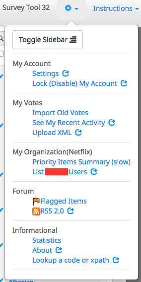
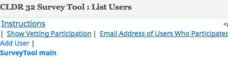
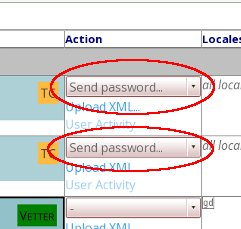
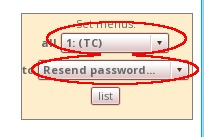
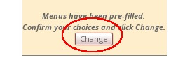
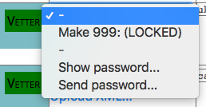
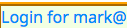
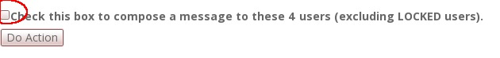
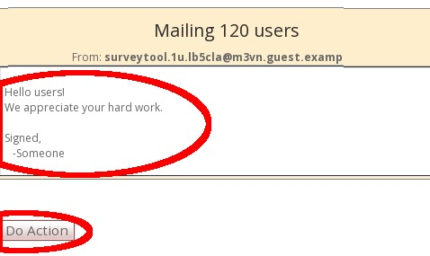
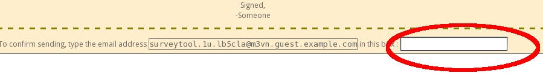

# Managing Users

If you have a TC or Manager level account, you can manage other translators
(users). When data submission starts, you'll want to Lock the users who are no
longer active, add new users, and send messages to your users. For the old users
you'll want to resend passwords -- it is simplest just to do that for everyone
once you've added new users.

When you create users, you give them permissions and choose which locales they
are to work on. It is also important that you set your organization's coverage
levels appropriately, see "[Setting your Organization's Coverage
levels](../coverage.md)".

## Managing Users

Open the survey tool, and click on the gear icon in the top left, then pick
**List <myorg> Users**

{width="160" height="320"}

The tool is still a bit awkward to use, so ask if you have any questions. Note
that you shouldn't use your TC or Manager account for voting; that should only
be done for carrying out committee decisions. What most people do is open a
second account as a Vetter if they have a language they want to contribute to.

## **To add a user**

1.  Click on \[Add User\] at the top:

    

    ➡️

2.  Set the name, email, and locales responsible. To see the locale codes, go to
    <http://unicode.org/cldr/apps/survey?p_codes=t>. Just use the language codes
    in on the right side-- the country parts are ignored.
    *   *Note that you must use the right code in the case of synonyms: use he
        **not** iw, use pt **not** pt_BR...*
3.  Set the Userlevel based on your assessment of the person's skill. Normally
    this is "Vetter". You can use "Street" for volunteers whom you don't know.
    People don't have to come from your organization as long as you have
    confidence in them.
    *   See the [CLDR Process](../../process/index.md) page for a description of
        the user levels and their privileges.
4.  *Known bug: if you try to create a user when the user already has an
    account, you get an unknown error message. Often this is because the user is
    locked. Click on "Show locked users", find the person, and change the status
    (see below).*

## **To resend a password**

**Make sure you let your users know that they should use their Survey Tool
password only for the Survey Tool, since it is often sent to them in email.**

1.  In the Action column, pick Send Password for each user you want to send.
    Then hit the \[Do Action\] button at the top or bottom of the screen to send
    the password to all selected users.

    

2.  If you want to do a bunch at a time, use the "Set menus" box on the left to
    fill in the Action columns
    1.  "all" means the type of user, so pick one or more of those. (eg TC)
    2.  "to" means what you want to do (eg Resend password)
    3.  Hit the "list" button to set the Action menus for those users.

        

    4.  You'll see a \[Change\] button; click to do the action (eg resending
        passwords to TC users)

        

## **To log in as one of your users**

1.  You will sometimes want to log in as one of your users, for testing. Click
    on the magnifying glass:
    
2.  Then use the action Show Password:
    
3.  **as that user.**You will then get a blue link for Login for XXX. Click on it to log in
    

## **To send a message to all your users**

1.  At the bottom, click the box for "Check this box to compose a message to..."

    

2.  Click \[Do Action\], and it will take you to a box to compose the message.

    

3.  Once you have entered the message, click \[Do Action\]
4.  Next, you need to confirm the message before it goes out.
    Fill in your address (you can copy and paste) in the box (*this is just to
    prevent mistakes*), and click \[Do Action\]

    

5.  Later on, in the vetting phase, you can send messages with the outstanding
    disputes (cases where people disagree on the translation) by checking the
    box marked "Check this box to send a Dispute complaint"

## **To change users' status**

1.  Click on the magnifying glass in the left column. You zoom in on that user,
    and have more Actions in the action column.
2.  Click the one you want, and hit \[Do Action\]
3.  Normally you don't want to delete users -- you want to Lock them. (Deleting
    removes information about what they've submitted so far.)

## **To check that all of your important locales have vetters assigned**

1.  Click the "Show Vetting Participation" link at the left, under the top gray
    bar.
2.  The Gray locales are ones that are not a priority for your organization
    according to coverage information. (If that's wrong, see "[Changing Your
    Organization's Coverage Levels](../coverage.md)" )
3.  If you need new locales added, let your committee representative know.
4.  To see what the participation of your vetters has been recently, click on
    the Participation Shown link at the top
    1.  Note: this has a bug currently where the table becomes very wide --
        you'll have to scroll or expand your window.

## **To see how your translators are doing**

1.  Open the Priority Items Summary (slow) in the Gear menu.
2.  Click on Recalculate
3.  Take a break, get a cup of coffee (may take 10 minutes or so).
4.  You then get a table that summarizes the status for each locale.
5.  We often find it useful to copy parts of that table into a spreadsheet for
    comparison.

1.  ~~To see what your translators have done, in the Gear menu go to **Priority
    Items Summary**~~
2.  ~~login to the Survey Tool and go to 'Manage … Users' and then to 'Show
    Vetting Participation' (link at top left).~~
3.  ~~You get a view of your translators.~~
4.  ~~Click on the link "Participation Shown (click to toggle) is currently On /
    Off ".~~
    1.  ~~Note: there is a bug with the top table causing it to be too wide.
        Maximize your screen size (and use a wide screen if you have one).~~
5.  ~~Go get a cup of coffee (this will take a little while)~~
6.  ~~At the bottom of the screen, you'll see a list of who has participated,
    and how many submits and votes they've each made.~~

## **To check if you have "bad" locales (locales assigned that aren't in CLDR)**

1.  Go to Coverage (up at the top right in the survey tool)
2.  If you see the following message, then some of your users have bogus locales
    OR locales that aren't in CLDR.
    1.  **Warning: locale designations not matching locales in CLDR: X....**
3.  Go to Manage Users (top right), and look at the users signed up to these
    locales
4.  When they are bogus fix them (work with translator to replace by real locale
    ids)
5.  When they are valid, you may propose to the committee that we add a locale:
    1.  Valid ones are under languages in en.xml
    2.  OR (unusual case) under languages in
        http://www.ietf.org/internet-drafts/draft-ietf-ltru-4645bis-04.txt
    3.  However, watch for mistakes, eg someone using "tw" to mean Taiwanese,
        when it actually means "Twi"
