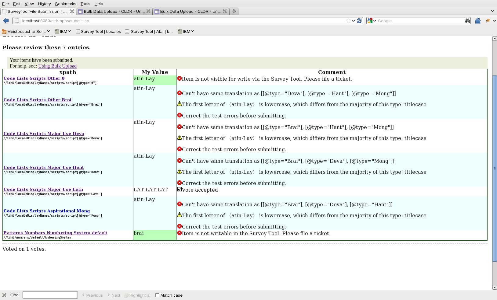

# Bulk Data Upload

Here are the instructions for a bulk upload (of an XML file in LDML format) to
the Survey Tool. You must be reasonably conversant with XML and the [LDML
format](http://unicode.org/reports/tr35/) to use this method.

1.  Prepare your xml files - one per locale. Each file must be valid XML and
    LDML for a single file. The file doesn't have to be "complete": it might
    contain only translations of territories, for example.
2.  The locale must exist.
    *   If not, see [Adding New
        Locales](http://cldr.unicode.org/index/bug-reports#New_Locales).
3.  You must be logged in, and under an account with permission to write to it.
    *   If you don't have an account, see [Survey Tool
        Accounts](http://cldr.unicode.org/index/survey-tool/accounts).
4.  Go to **Manage** >> **Upload XML**
5.  Put in your email address to submit as yourself. If you manage other users,
    you may put their address in to submit a vote as that user.
6.  Click **Choose File** to pick the XML file for that locale on your locale
    disk
7.  Click **Upload as my Submission/Vetting choices**
8.  You will see a raw listing of lines in XML, and an error line if the file
    doesn't validate.
    1.  If the file does not validate, fix the file, hit the back button, and go
        to *Step 4*.
    2.  If the file does validate, you'll see a list of XML paths and values.
9.  Click **Submit <locale>**.
10. You will see a detailed list of the test results for the items you're
    submitting.
    *   You can click on an item's path link (left hand side) to view that item
        in the surveytool
    *   Any items with an error icon will not be submitted.
    *   If the message is "Item is not writable in the Survey Tool. Please file
        a ticket." then you will need to [file a
        ticket](http://www.unicode.org/cldr/trac/newticket) instead. These can
        be filed in a single ticket. Include all the paths and the respective
        values.
11. Press "Really Submit As My Vote" to submit all passing items as your vote,
    or revise the file and start back at *Step 4*.

### Example XML:

<pre><code>
&lt;?xml version="1.0" encoding="UTF-8" ?&gt;
&lt;!DOCTYPE ldml SYSTEM "../../common/dtd/ldml.dtd"&gt;  &lt;!-- Not important. Latest DTD will be used. --&gt;
&lt;ldml&gt;
  &lt;identity&gt;
    &lt;version number="$Revision: 6546 $"/&gt; &lt;!-- ignored --&gt;
    &lt;generation date="$Date: 2012-02-07 10:32:35 -0800 (Tue, 07 Feb 2012) $"/&gt; &lt;!-- ignored --&gt;
    &lt;!-- <b>CRITICAL</b>: you must supply a valid identity block specifying language,
          and if part of the identity, the script, region, variant, etc. --&gt;
    <b>&lt;language type="aa"/&gt;</b>  <b>&lt;!-- Required --&gt;</b>
  &lt;/identity&gt;
  &lt;localeDisplayNames&gt;
    &lt;scripts&gt;
      &lt;!-- The draft attribute and alt=proposed value are ignored. Comments are ignored.  --&gt;
      <b>&lt;script alt="proposed-ABCDEF" type="Latn" draft="unconfirmed"&gt;Latin&lt;/script&gt;  &lt;!-- OK. --&gt;</b>
      &lt;!-- The rest indicate errors people might have. --&gt;
      &lt;script alt="proposed-ABCDEF" type="Mong" draft="unconfirmed"&gt;Latin&lt;/script&gt; &lt;!-- ERR: duplicate --&gt;
      &lt;script alt="proposed-ABCDEF" type="Brai" draft="unconfirmed"&gt;Latin&lt;/script&gt; &lt;!-- ERR: duplicate --&gt;
      &lt;script alt="proposed-ABCDEF" type="Hant" draft="unconfirmed"&gt;Latin&lt;/script&gt; &lt;!-- ERR: duplicate --&gt;
      &lt;script alt="proposed-ABCDEF" type="Deva" draft="unconfirmed"&gt;Latin&lt;/script&gt; &lt;!-- ERR: duplicate --&gt;
      &lt;script alt="proposed-ABCDEF" type="0" draft="unconfirmed"&gt;Latin&lt;/script&gt;    &lt;!-- ERR: bad 'type' --&gt;
    &lt;/scripts&gt;            
  &lt;/localeDisplayNames&gt;
  &lt;numbers&gt;
    &lt;defaultNumberingSystem&gt;brai&lt;/defaultNumberingSystem&gt;  &lt;!-- ERR: can't change via survey tool --&gt;
  &lt;/numbers&gt;
&lt;/ldml&gt;
</code></pre>

Note: the filename of the XML file doesn't matter

### Example Submission View:

**Note to Organization Managers**: if you are submitting on behalf of another
user, clicking these links will switch your user to that user.

