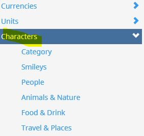
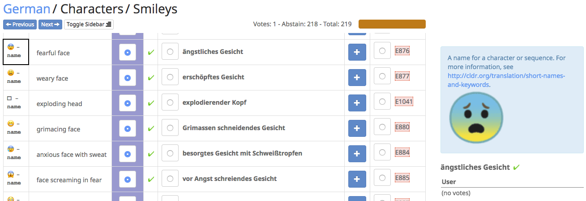
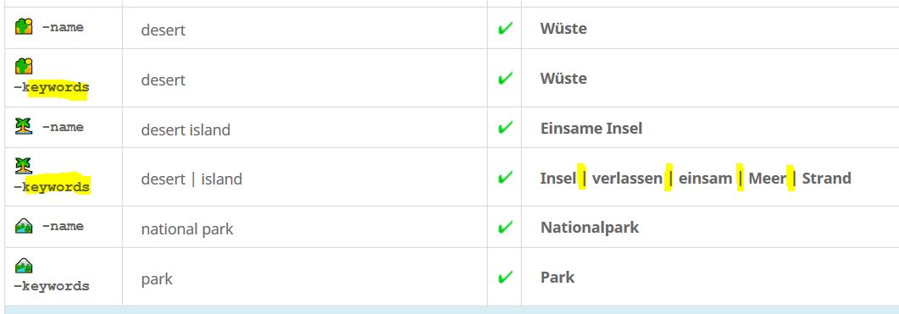

# Emoji Names and Keywords

[TOC]

CLDR collects short character names and keywords for Emoji characters and
sequences.

These are found in Survey Tool under **Characters**, and they are divided into
different category types. For example, Smileys, People, Animal & Nature, etc...

> > > {width="200" height="189"}

## No Font support

If you see a "tofu" box in the Code column (as shown in the screenshot below),
it may be that your system doesn't have font support to display the emoji
images.

However an emoji image should show up in the right-hand navigation bar, as
below.

{width="400" height="137"}

## References

*   It is often useful to view related languages to see how the emoji are
    handled. You can see the last release results at
    <http://www.unicode.org/cldr/charts/latest/annotations/index.html> , or open
    up the survey tool in another window and pick another language.
*   You can also find information about other images by doing the following:

> 1.  Go to the page <http://unicode.org/emoji/charts/full-emoji-list.html> (you
      can leave this window open while you work on the emoji section).
> 2.  Open the "Find in page" menu (typically control or command-F), and paste
      in the character you can't see (eg, 😅) or search for the English name
      (e.g. "star-struck")
> 3.  You should see the images for the emoji, as below.

## Constructed

Many of the emoji names are constructed, which means that in implementations
emoji, multiple parts are used to construct and add on to other emoji. These
emoji that can be used as *parts* to add on are found in under **Characters** in
the Survey Tool, under **Component**, **People**, and **Category**. *Please
review these carefully!*

    1.  **Characters\\Component** contains special emoji whose names are used
        for emoji with hair colors and skin tones.
        1.  Carefully check all of these using examples provided in the right
            pane when you hover over each translated term (either in the Winning
            or Others columns)

            {width="400"
            height="73"}

        2.  Correct meaningless translations. We have seen in some languages
            problems with older terms for the skin tones that won't mean
            anything to users. Use understandable terms like **“light skin”**
            instead of numbered levels like **“peau 1”.**
        3.  CLDR doesn't have gender agreement for nouns, so please choose the
            grammatical forms that work the best.
            For example, in some languages there will be an adjective for
            **“light skinned”** that would need to agree with the noun (man or
            woman). It may work to make noun phrases instead, eg **“light
            skin”** or **“bald head”**.
    2.  **Characters\\People** contains three values which are used to construct
        emoji.
        1.  All of these have examples marked by an ⓔ in the English Column.
        2.  Hover over the ⓔ to see how some sample constructed emoji would look
            in
            English.{width="400"
            height="120"}
    3.  **Characters\\Category** contain terms like “flag” (used in constructing
        flag names). These 3 terms are also marked with ⓔ, so make sure to
        review each of the examples in English and your language.
    4.  **Blond/Bearded.** The people with blond hair or beards need to have
        names consistent with those used for hair styles (see [dark skin tone
        examples](http://cldr-smoke.unicode.org/smoketest/v#/USER/Component/4da6f737d7901c30)),
        such as:
        1.  [🧔 — man:
            beard](http://cldr-smoke.unicode.org/smoketest/v#/USER/People/20a49c6ad428d880)
        2.  [👱 — person: blond
            hair](http://cldr-smoke.unicode.org/smoketest/v#/USER/People/5cae8a8d1de49cd9)
        3.  [👱‍♂️ — man: blond
            hair](http://cldr-smoke.unicode.org/smoketest/v#/USER/People/532f430d6e2a26f)
        4.  [👱‍♀️ — woman: blond
            hair](http://cldr-smoke.unicode.org/smoketest/v#/USER/People/3f3d3e9ef4f5768b)

## FAQ Tips for character names and keywords

*   Buttonized category: Add the wording "button"
    *   "Up! button" 🆙 or Japanese "reserved" button 🈯, use the wording "button"
        in your language rather than referring to them as Ideogram or Ideograph.
*   Emoji specific to a country/region: reflect the usage in your locale.
    *   If the Japanese [beginner
        symbol](https://emojipedia.org/japanese-symbol-for-beginner/) (🔰)
        represents something else in your locale, you should adjust the name to
        reflect that. If it has no known meaning in your locale, you could refer
        to it as "shoshinsha mark" to make the origin clear.
    *   For the “[flower playing
        cards](https://emojipedia.org/flower-playing-cards/)” 🎴: For example, in
        Swedish, the name is “hanafuda-spelkort, which use the Japanese name
        “Hanafuda” the translation of the English descriptive name.
    *   [Mahjong red dragon](https://emojipedia.org/mahjong-tile-red-dragon/) 🀄:
        For example, in Swedish, the name is “mahjong röd drake”, which is a
        Chinese name with the literal translation of the English red dragon.
    *   [Kaaba](https://emojipedia.org/kaaba/) 🕋: For example, in Swedish, the
        name is Kaba, based on Swedish wikipedia
        <https://sv.wikipedia.org/wiki/Kaba>.
*   Sensitivities in your locale. For example:
    *   where alcohol is prohibited: Names and keywords of emoji that could be
        associated to alcohol should be handled with sensitivity to your locale.
        You could describe the emoji without reference to alcohol. For example
        "wine glass" 🍷 may be associated to *sparkling drinks* rather than
        *wine*.
    *   where gambling is prohibited: Names and keywords of emoji associated
        with gambling (for example 🎲, ♣️, 🎰) should be handled with sensitivity
        to your locale. For example to describe as "dice" or "card" with no
        association to gambling in names or keywords.
*   Avoid using words that may describe one's opinion or sentiments. Use
    unbiased descriptive words. (For example, do not use "faith" in relation to
    a religious emoji.)
*   Be careful not to be overly purist about keywords. The goal of keywords is
    to define what people might search for in addition to the defined name. This
    means that the keywords do not need to follow formal taxonomies.
    For example, if a user is likely to type "plant" (or equivalent in their
    language) when searching for a mushroom, then the mushroom emoji should have
    "plant" as a keyword, even if that is not ==[biologically
    accurate](https://en.wikipedia.org/wiki/Fungus)==.
*   For the Character > Categories > Label (such as
    ==[French](http://st.unicode.org/cldr-apps/v#/fr/Category/19624f4413eaac8b)==),
    whether or not a label is plural will depend on the label and the language.
    The pluralization choice will not necessarily follow the English.

## Short Character Names

In CLDR we provide descriptive but short names for the characters across
languages. (For reference, see [Background: Unicode Std. vs CLDR
names](http://cldr.unicode.org/translation/characters-emoji-symbols/short-names-and-keywords#TOC-Background:-Unicode-Std.-vs-CLDR-names).)
Goals for the short names collected in CLDR are:

**Unique** Be unique among emoji names for that language. (You will receive an
error in the survey tool if the name is already in use for another emoji.)
**Short** Be short (as much as possible), both written and spoken.
**Descriptive** Be descriptive of the prevailing color images. Don't be
"over-descriptive", however. The descriptions only have to be enough to
distinguish each image from the others: they shouldn't have any details beyond
that. **Consistent** Be consistent across images with similar features. (Don’t
call 📫 a *mailbox* and 📬 a *post box*). **Flexible** It is **not a goal** to be
immutable: in future versions of CLDR, you can improve names by casing new
suggestions if a more appropriate names are available. **Not Literal** Names
should **not just be literal translations** of the English— the names should be
based on associations to the image *in your language.* But you can be *informed*
by the English names.

When voting on the emoji names and keywords:

*   Follow the middle of sentence rule. See
    [Capitalization](http://cldr.unicode.org/translation/translation-guide-general/capitalization)
    guideline.
*   As usual, the names in “en” are American English; where necessary those are
    customized for “en-GB”. For differences for sub-locale, see [Regional
    Variant](http://cldr.unicode.org/translation/getting-started/guide#TOC-Regional-Variants-also-known-as-Sub-locales-)
    guideline.

### Unique Names

The names must be unique. If you try to give two different emoji the same name,
you will get an error, such as in the following, where the same name is given to
"tiger" and "leopard" as shown in the image below.

Tips on how to handle unique names:

*   For animals and plants, it often helps to check the background of the
    English name, such as [Tiger](https://en.wikipedia.org/wiki/Tiger) and
    [Leopard](https://en.wikipedia.org/wiki/Leopard), or look at languages
    related to yours to see how they are handled. For example, some Nordic
    languages don't distinguish
    [Octopus](http://www.unicode.org/cldr/charts/dev/annotations/germanic.html#%F0%9F%90%99)
    and Squid, so people have had to come up with an alternative translations.
*   To handle name conflicts between a Zodiac symbol name with an animal/bug
    (Scorpius Zodiac vs Scorpion),
    try one of the following:
    *   Add "zodiac" to all the zodiac signs
    *   Add "zodiac" only to the conflicting item (e.g. Scorpius Zodiac)
    *   Add a term to qualify the animal/bug
*   Unique name conflicts will be different for every language; however, you
    could look at how other languages have handled similar conflicts and get
    ideas on how to get around unique name errors.

Other common problem cases that must be distinguished. **NOTE that punctuation
and uppercase vs lowercase distinctions are discarded when testing for
uniqueness!**

🌀 🌪 Cyclone vs Tornado 🌒 🌓 🌔 🌖 🌗 🌘 🌙 Different phases of the moon 🎵 🎶 Different
numbers of notes ♏ 🦂 Symbol vs animal 💃 🕺 Woman vs man 😡 😬 Pouting vs grimacing
🚽 🚻 🚾 Toilet vs restroom vs WC (water closet) 🆙 🔼 "Up!" button vs upwards
button.

### Gender

There are different ways emoji may have gender.

*   No specific gender
    *   smilies or human-form emoji where the gender is hidden, such as [person
        fencing](http://www.unicode.org/cldr/charts/dev/annotations/germanic.html#%F0%9F%A4%BA).
*   Specific gender
    1.  Singletons (eg man) such as [business man
        levitating](http://www.unicode.org/cldr/charts/dev/annotations/germanic.html#%F0%9F%95%B4).
    2.  Pairs (man, woman) such as [prince and
        princess](http://www.unicode.org/cldr/charts/dev/annotations/germanic.html#%F0%9F%A4%B4).
    3.  Full triples (man, woman, gender-neutral) such as [man detective, woman
        detective](http://www.unicode.org/cldr/charts/dev/annotations/germanic.html#%F0%9F%95%B5),
        and just
        [detective](http://www.unicode.org/cldr/charts/dev/annotations/germanic.html#%F0%9F%95%B5)
        (either one).

For the full triples, we need three unique names:

*   X1 (=male only; no females)
*   X2 (=female only; no males)
*   X3 (=either male or female)

In some languages it may be tricky to do this, especially for the neutral case.

#### Gender-neutral forms

*   The label you use for a gender-neutral form must apply to either men or
    women in that role, and must have a different name than the "man" version or
    "woman" version.
*   For example
    *   German uses Feuerwehrmann for “fireman” (male fireman) and
        “Feuerwehrfrau” for ‘firewoman’ (female firefighter)
        *   When you add a gender-neutral name, you may get an error because it
            collides with the male or female forms. *Be sure to fix such error
            before leaving the page.*
        *   For example, you cannot add Feuerwehrmann as a name for
            ‘firefighter’ (gender neutral), because that would collide with
            Feuerwehrmann for ‘male fireman’.

        If your language only normally has two terms (eg "student" and
        "studentă") then there are a couple of possibilities:

        *   **A.** If the word "student" excludes females, and "studentă"
            excludes males, then you would use X1="student", X2="studentă", and
            then a phrase for X3 such as "student/studentă" (see below).
        *   **B.** If the word "student" can mean either male or female, then
            you would use X2="studentă", X3="student", and a qualified phrase
            for X1 such as the translated equivalent of "male student".
        *   Note: if the wording has to be awkward for one of the forms, it is
            probably better to use the awkward language for the gender-neutral
            form, eg X3.
*   When looking for possible gender-neutral forms
    *   Look at the existing gender-neutral terms, like for *person running /
        man running / woman running*, or *detective / man detective / woman
        detective*.
    *   Check whether possible neutral terms such as
        “[Feuerwehrmensch](https://www.google.com/search?q=Feuerwehrmensch)”
        (roughly ‘fireperson’) are commonly understood.
        *   A web search may help to ensure that a term is commonly understood.
            Be sure to use quotation marks if you don't have a single word. For
            example:
            *   <https://www.google.com/search?q=Feuerwehrmensch>
            *   <https://www.google.com/search?q="Feuerwehrmann/-frau">
    *   In some languages you may have to use parentheses or slashes or even
        spell out an “or” if need be. The exact tactic will depend on what is
        acceptable in your language, but strive for brevity where possible. For
        example:
        *   “[Feuerwehrmann/-frau](https://www.google.com/search?q=%22Feuerwehrmann/-frau%22)”,
            “[bombera/o](https://www.google.com/search?q=%22bombera%20o%20bombero%22)”
            (roughly ‘fireman/-woman’)
        *   “[Feuerwehrmann/Feuerwehrfrau](https://www.google.com/search?q=%22Feuerwehrmann/Feuerwehrfrau%22)”
            (roughly ‘fireman/firewoman’)
        *   “[Feuerwehrmann oder
            Feuerwehrfrau](https://www.google.com/search?q=%22Feuerwehrmann%20oder%20Feuerwehrfrau%22)”,
            “[bombera o
            bombero](https://www.google.com/search?q=%22bombera%20o%20bombero%22)”
            (roughly ‘fireman or firewoman’).

*Be sure to review the way in which this has been done for other cases in your
language (and related languages) so that you are as consistent as possible.*

## Character Keywords

Keywords are one or more words or short phrases that can be used to search for
the character in your language.

When picking keywords, remember the following goals:

**==Not== Unique** Unlike the short names, keywords **do not have to be unique**
across different emoji. For example, in English "mailbox" is a keyword
associated to any of (📫 📪 📬 📭). **==Not== Short** Unlike the short names, the
keywords **need not be as short** as possible. Don't go overboard in length,
however! **Number** Each keyword should help narrow down the choices among
emoji. The goal is to provide the best set of keywords that are relevant to the
emoji; be mindful of the number of keywords and try to limit the number of
keywords below 5. (You will start to see a warning on keywords beyond 6.) Here
are some tips on how to be mindful of the number of keywords:
• Don't add grammatical variants: pick one of {"walks", "walking"}; pick one of
{sake, saké}. • Don’t add emoji names (these will be added automatically) •
Don’t add repeats of words starting with the same starting word in the emoji
name.
For example, for "umbrella with rain drops" emoji, the set of keywords
considered are {clothing | drop | rain | umbrella | umbrella with rain drops};
but, you do not need {umbrella} and {umbrella with rain drops}. Thus, the best
set of keywords are {clothing | drop | rain}. Please follow these guidelines
even if the source English does not. **Separation** A " | "(pipe)character is
used to separate each keyword when there are multiple keywords for an emoji (see
screenshot below). When you want to append another keyword, click the + to add,
copy the Winning value, and append " | " before adding your new keyword.
**Ordering** The **ordering of keywords are not significant**. Do not add new
suggestions only for the ordering of the keywords. Keywords are in "alphabetical
order" (default Unicode ordering), and will override any ordering you provide in
your suggestion. **Not Literal**

Like the short names, the keywords should **not just be literal translations**
of the English — the keywords should be based on associations to the image *in
your language.* It does not need to be the same number of keywords in your
language as there are in English! But you can be *informed* by the English
names.

**Not offensive** Do not add keywords for an emoji where the association of the
two could be offensive to many people. For example, do not use “superstition” as
a keyword for the emoji related to religion, or add a keyword for a particular
nation to the goblin emoji (👺).

### Keywords vote calculation

Emoji keywords are unique in the Survey Tool voting experience because it
contains multiple item (words) in a single vote. The following enhancements to
the Survey Tool are introduced starting in v34 to help improve the efficiency of
keyword voting efforts.

1.  **Keyword voting:** The calculation of the winning set of keywords is now
    different. Beforehand, if you had the following choices, #1 would win. Now,
    the fact that #2 is a subset of #3 gives it a larger weight in voting, and
    #2 will win.
    1.  {small} : 4 votes
    2.  {big | large} : 3 votes
    3.  {big | large | grand} : 3 votes
2.  **Keyword de-duplication:** If one keyword phrase is covered by other
    keyword phrases, then it will be removed. For example, the set {big bad wolf
    | big | bad | wolf} ⇒ {bad | big | wolf}. This will happen automatically as
    you enter values.
    1.  Note that the items in the set are also automatically alphabetized: {big
        | bad | wolf} ⇒ {bad | big | wolf}

### Keywords in Survey Tool view

## Background: Unicode Std. vs CLDR names

The Unicode Name character property are part of the Unicode standard. They are
immutable, unique IDs over all Unicode characters, and limited to uppercase
ASCII letters, digits and hyphen. The names often do not apply well to the
prevailing practice for emoji images, and are only available in English. Their
main purpose is to serve as unique identifiers, and may not be particularly
descriptive or short. Example: ɞ U+025E LATIN SMALL LETTER CLOSED REVERSED OPEN
E. Because the Unicode Name is immutable, it cannot change to reflect that.

The Unicode Name may inform the English CLDR short names, and that is what we
start with (for English) unless one of the other factors come into play. CLDR
short names are not limited to ASCII or uppercase, even in English.

## Animal Faces

A: For some animals, there are two different emoji, one of which has a name
including the word “face”: for example, 🐕 U+1F415 *dog* and 🐶 U+1F436 *dog
face*. In these cases, the use of “face” in the name is important for
distinguishing the two emoji, and the name in your language should include an
indication that it is the face rather than a whole or partial body.

For other animals, there is no such distinction. For example, there is only one
wolf: 🐺 U+1F43A*.* In that case, you don't need to use a term corresponding to
“face” in your language, even if the English name has the word face (that is
often due to historical accident.)
