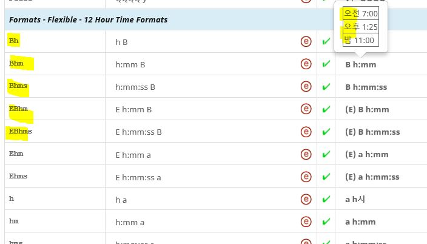

# Date/Time Patterns

*Last updated: 2018-May-14*

## Patterns Introduction

Pre-requisite topics to read:

*   [Date/Time Symbols](../date-time.md)
*   [Date/Time Names](../date-time-names/index.md)

A date-time pattern is a string of characters where date and time symbols are
combined together with necessary "literal" strings that is used as is.

There are two types of substrings that are combined in a pattern:

1.  Date/time symbols and placeholders that represent particular calendar fields
    such as, month, weekday, year, etc..
2.  "Literal" strings used as-is. These are necessary to make the pattern flow
    naturally in a given language.
    For example:
    Skeleton format **English Pattern** **English Example** **Japanese Pattern**
    **Japanese Example** **yMMMd** MMM e, y Dec 5, 2010 y年M月d日 2010年12月5日

There are three aspects to patterns:

*   A letter symbol (a-z; A-Z) indicates the type of calendar field: See
    [Date/Time Symbols](../date-time.md).
    For example:
    *   M for month
    *   d for week day
    *   y for year
*   The number of letters indicate the formof the names to be used.
    Example use for month would be:
    *   Numeric representation: M or MM for 9 or 09, with leading 0. This is
        intended to be used in conjunction with a day number; thus, 9/12 or
        09/12
    *   Abbreviated form: MMM for Sep
    *   Full form: MMMM for September
    *   Narrow form: MMMMM (S)
*   When formatting a particular date, non-numeric values (e.g. month names from
    Gregorian calendar) are substituted into the appropriate pattern substrings
    using the [Date Format Symbols](../date-time.md).
    For example:

    *   M replaced by “3” for March
    *   MMMM replaced by “March”.
    *   When parsing a date string, the pattern substrings will be converted
        into the appropriate numeric calendar data.
    *   **See [Date/Time Symbols](../date-time.md) for a brief summary of
        letters for different calendar fields, or [Date Field Symbol
        Table](http://www.unicode.org/reports/tr35/tr35-dates.html#Date_Field_Symbol_Table)
        for a more complete and detailed list.**
*   The "literal" text in the date-time pattern are used as-is when formatting,
    and are expected when parsing a date string. To include a single straight
    quote as part of the literal text, use two of them together: '' (either
    inside or outside a section of literal text enclosed in single straight
    quotes).

To demonstrate how this work with examples, see the spec [Date Format Pattern
Examples](http://www.unicode.org/reports/tr35/tr35-45/tr35-dates.html#Date_Format_Pattern_Examples).

**{width="80" height="50"}**

    For "literal" text that should be included in patterns, enclose it in single
    straight quotes. For example, to include "o'clock" in a long time pattern
    (hh 'o''clock' a, zzzz)

*   In order to provide the correct date and time patterns for your language,
    you may need to reorder the symbols. For example, you would need to reorder
    the American date pattern d/M/y to MM/dd/y if your locale puts the month
    first in short date patterns.
*   **Always look at examples!** Examples are in the Information Pane or hover
    over. When working with date and time formats, there are many substitution
    and dependencies to different calendar; therefore, the example are best
    representation to validate your intention on the end result.

Synchronizing Date/Time Names and Patterns

There is a tight coupling between the date/time patterns and the names that are
used for date/time elements, described in [Date/Time
Names](../date-time-names/index.md). Therefore, when supplying the data, it
requires coordination between what you supply as the names and your intention on
which name to use in patterns.

## When to use Standalone vs. Formatting

Some types of names have two styles and these are differentiated in the survey
tool section headings a Formatting and Standalone.

Using the month names as examples:

*   **format style:** Use formatting-style month names represented with "M" when
    month names is displayed with a day-of-the-month number (e.g. d MMMM y: 5
    Monday January 1999).
*   **stand-alone style:** Use the stand-alone month names represented with "L"
    when the month name is without a day-of-the month. (e.g. LLLL y: Monday
    1999)

Following are examples of differences and implications based on language:

wide **format** months (Use pattern:
MMMM) wide **stand-alone**
months
Use pattern:
LLLL) pattern for full date, e.g.in e-mail log:
“d. MMMM y”; thus, intended to use the format style names as examples below.
pattern for month + year, e.g. in calendar:
“LLLL y”; thus intended to use the stand-alone names as examples below: pattern
for month name by itself, e.g. in menu:
“LLLL”; thus, intended to use the stand-alone names as
examples below: 7
heinäkuuta heinäkuu 5. heinäkuuta 2018 heinäkuu 2018 heinäkuu 8 elokuuta elokuu
10. elokuuta 2018 elokuu 2018 elokuu 9 syyskuuta syyskuu 15. syyskuuta 2018
syyskuu 2018 syyskuu 10 lokakuuta lokakuu 20. lokakuuta 2018 lokakuu 2018
lokakuu

*   Some language (e.g. Catalan) use a preposition to combine the month and day
    number, e.g. “11 de setembre” (11 of September). If the month name begins
    with a vowel, the preposition is contracted, e.g. “12 d’octubre”.
    For these languages:
    *   The **format** month names should include the preposition in its correct
        form (contracted or not)
    *   And the **stand-alone** month names should **NOT** include the
        preposition
        *   And the **patterns** using the stand-alone should not include the
            preposition for month
*   In some languages, the weekday name format forms (e.g. EEEE) and stand-alone
    forms (e.g. cccc) forms may also differ, and may require similar
    coordination between names and patterns.
    Below examples are with month names.

wide **format** months
Use pattern (MMMM) wide **stand-alone**
months
Use pattern
(LLLL) pattern for full date,
e.g.in e-mail log:
“d MMMM 'de' y”; thus, intended to use the format style names as
examples below: pattern for month + year, e.g. in calendar:
“LLLL 'de' y”; thus intended to use the stand-alone names as
examples below: pattern for month name by itself, e.g. in menu:
“LLLL”; thus, intended to use the stand-alone names as examples below: 7
de juliol juliol 5 de juliol de 2018 juliol de 2018 juliol 8 d’agost agost 10
d’agost de 2018 agost de 2018 agost 9 de setembre setembre 15 de setembre de
2018 setembre de 2018 setembre 10 d’octubre octubre 20 d’octubre de 2018 octubre
de 2018 octubre

{width="80" height="50"}

*   When working with patterns, look at the examples in the right information
    pane to validate your intention between the name and the pattern.
*   In order to get the right formats for your language, you may need to change
    the ordering of the [Date/Time Symbols](../date-time.md), and change the
    text around them.
*   You must match the names that should be used in patterns with intended forms
    of the names (wide or full, abbreviated and/or short, narrow forms)
    For example:

    *   If you specify the time format "h:mm a", by using "a" your intention is
        to use the **Abbreviated formatting** name for AM/PM; thus, the end
        result being 2:37 PM.
    *   If you specify the time format "h:mm aaaa", by using "aaaa", your
        intention is to use the **Wide formatting name** for AM/PM; thus, the
        end result being 2:37 Post Meridiem. (NOT a good example s most language
        use a)

*   Understand the difference between formatting and standalone date and time
    names in your language and its intended usage in patterns. For example, if
    you are working in Catalan (a locale that uses prepositions in formatting
    month names), and you provide “setembre” for the formatting month name
    instead of “de setembre,” then the pattern d MMMM will display as “12
    septembre” instead of the correct pattern “12 de setembre.
*   Some languages (e.g. Finnish and many Slavic languages) use a month name in
    nominative case when it is displayed without a day number, and use a
    different case (genitive, partitive, etc.) when the month is displayed with
    a day number. For these languages:
    *   The **stand-alone** month names should be **in nominative case**,
    *   And the **format** month names should be in genitive or a related case.
*   Even for language that do not require such different forms it is a good
    idea, for consistency, to use ‘L’ for months in patterns without ‘d’, and
    ‘M’ for months in patterns with ‘d’.

Basic Time Formats

The standard formats include four basic time formats. See Survey Tool
[Formats-Standard-Time
formats](https://st.unicode.org/cldr-apps/v#/USER/Gregorian/1b89d7c2d516faca).

*   full: Include hour (h/H), minute (mm), second (ss), and zone (zzzz).
*   long: Include hour, minute, second, and zone (z)
*   medium: Include hour, minute, second.
*   short: Include hour, minute.

Using 24 hour vs 12 hour symbols: The symbols you use in time format patterns
depend on whether the main country/region of the language uses 12-hour time or
24 hour format.

    If the default country/region of the language use the 12-hour time clock,
    use patterns like "h:mm a" or "hh:mm a"

    *   **h** to mean a 12-hour clock cycle running 1 through 12 (midnight plus
        1 minute is 12:01) with hh indicating leading zero to 2 digits
    *   K to mean a 12-hour clock cycle running 0 through 11 (midnight plus 1
        minute is 0:01).
    *   **a** to get the equivalent of AM/PM
    *   **b** to add special representation of noon/midnight
    *   **B** to use day periods like “in the afternoon” instead of AM/PM.
*   If the default country/region of the language uses the 24-hour time clock,
    use a pattern like **"H:mm"** or **"HH:mm"**
    *   **H** to mean a 24-hour clock cycle running 0 through 23 (midnight plus
        1 minute is 0:01) with **HH** indicating zero-padding to 2 digits
    *   **k** to mean a 24-hour clock cycle running 1 through 24 (midnight plus
        1 minute is 24:01).
    *   **a, b,** and **B** are same as usage in 12 hour formats.

If a non-default country/region use a different time format than the default
country/region for the language, then this difference should be added for the
sub-locale. Also see [Regional
variant](http://cldr.unicode.org/translation/getting-started/guide#TOC-Regional-Variants-also-known-as-Sub-locales-)s.

For example, if es (= es_ES, Spanish as used in Spain) uses 24-hour time
formats, but es_US (Spanish as used in United States) uses 12 hour time formats,
then es would use "HH:mm/H:mm" and es_US would use the "h" formats as described
above. .

    Languages should always have translations for AM/PM/noon even if every
    country/region that the language is used in has 24 hour time. Many computing
    systems provide the flexibility for users to specify either 12 or 24 hour
    time setting on their system (also known as User preference overrides). This
    is why CLDR provide the flexible formats for both 12 and 24 hour systems.

## Basic Date Formats

The standard Date formats include four basic formats. See Survey Tool
[Formats-Standard-Date
formats](https://st.unicode.org/cldr-apps/v#/USER/Gregorian/562f98c4c6b2e321).
(Note that the Month symbol especially may vary (M vs MM, or MMM vs LLL). For
more information, see [Date/Time Symbols](../date-time.md).)

Form **Include** **English pattern examples** Full long-weekday (EEEE), year
(y), long-month (MMMM), day
In some non-Gregorian calendars, it will also contain G representing the era
name, such as "AH" or "Heisei" (i.e. "平成").
For some languages, long months are not used; for example, in Japanese the
numeric month is used in patterns, in front of the character 月. EEEE, MMMM d, y
(e.g. "Tuesday, September 14, 1999") Long year (y), long-month (MMMM), day (d).
MMMM d, y (e.g. "September 14, 1999".) Medium year (y), abbreviated-month (MMM),
day (d).
For languages that do not use abbreviated months, use the numeric month (MM/M).
For example, **"y/MM/dd"**, corresponding to a date like "1999/09/14". MMM d, y
(e.g. "Sep 14, 1999".) Short year, numeric-month (MM/M), and day. M/d/yy (e.g.
"9/14/99")

## Additional Date-Time Formats

The basic formats as described in above sections provide a small subset of the
combinations. To expand to fully cover all variations of date and time formats,
a *skeleton* format is provided that uses the [Date/Time
Symbols](../date-time.md) (without order or punctuation) to indicate what fields
are desired.

An example usage of the flexible formats would be: a software program only needs
the year and month information, the flexible pattern yMMM would be used to
provide the desired year and month formatting as shown in the English and
Japanese examples in this table.

**Skeleton** **English Pattern** **English Example** **Japanese Pattern**
**Japanese Example** **yMMM** MMM y Dec 2010

y年M月

2010年12月

#### Standalone vs. Formatting in Flexible formats

In languages that distinguish between nominative and genitive (or related form
such as partitive), the use of symbols in flexible formats also specify the use
of nominative forms or genitive (or related) forms of month and day names.

*   [skeleton MMM or
    MMMM](https://st.unicode.org/cldr-apps/v#/USER/Gregorian/e11a0c5e17bc068)
    are intended to use the formatted names and most languages will use
    LLL/LLLL.
*   month names when day is not included (e.g. skeleton:
    [yMMM](https://st.unicode.org/cldr-apps/v#/USER/Gregorian/6fea4427938536b8))
    *   Specify the nominative forms in the **standalone** month names.
    *   Use the symbol "LLL" or "LLLL" in the patter, therefore, "LLLLy"
*   month names when day is included (e.g. skeleton:
    [MMMd](https://st.unicode.org/cldr-apps/v#/USER/Gregorian/3124a5a401a45c9))
    *   Specify the genitive form (or a related form such as partitive) in
        **format** month names
    *   Use the symbol "MMM" or "MMMM"; therefore resulting in "d MMMM"
*   day names may also vary for your language depending on the elements included
    in the pattern (e.g. [ skeleton
    E](https://st.unicode.org/cldr-apps/v#/USER/Gregorian/140cf3a4c102803b) for
    day only, or [skeleton MEd
    ](https://st.unicode.org/cldr-apps/v#/USER/Gregorian/2d123e52098e97f2)for
    month, day, and numeric day)
    *   Use symbols "ccc" or "cccc" in patterns to use the standalone name
    *   Use the symbol "E" or "EEEE" to use the format name

To understand which pattern characters are used for standalone forms
(nominative) versus format forms (genitive or related, such as partitive), see
[Stand-Alone vs Format Styles](../date-time.md), see also the discussion above
in [Synchronizing Date/Time Names and Patterns](index.md).

#### Supplied vs. Inferred patterns

Some patterns supplied for each skeleton may be extended from the abbreviated
form to an inferred full form by developers who use CLDR.

Some Inferred patterns usage are incorrect, instead use the most closely
associated skeletons that are available. Build on a chain of fallback options
based on available patterns is a good practice.

Example expansions:

**Skeleton** **Hypothetical English case** **For ja@calendar=chinese**
**Pattern** **Example** **supplied** MMMEd E MMM d Tue Apr 18 MMMd日(E) 四月18日(火)
**inferred 1** MMMMEd E MMMM d Tue April 18 MMMMd日(E) 四月18日(火) **inferred 2**
MMMEEEEd EEEE MMM d Tuesday Apr 18 \[incorrect\] MMMd日(EEEE) 四月18日(火曜日)
\[incorrect\] **inferred** **3** MMMMEEEEd EEEE MMMM d Tuesday April 18
\[incorrect\] MMMMd日(EEEE) 四月18日(火曜日) \[incorrect\]

**supplied** MMMEEEEd EEEE, MMM d Tuesday, Apr 18 \[correct\] MMMd日EEEE 四月18日火曜日
\[correct\] **inferred** **4** MMMMEEEEd EEEE, MMMM d Tuesday, April 18
\[correct\] MMMMd日EEEE 四月18日火曜日 \[correct\]

The correctness of inferred from abbreviated the full will differ by locale.

In the examples above table, Inferred 2 and Inferred 3 examples are incorrect,
because:

*   English examples are incorrect, because you'd want a comma after the full
    day name EEEE (Tuesday, Apr 18).
*   Japanese examples are incorrect, because the day name should not be in
    parenthesis.

~~If that results in correct behavior, there may be no need to supply the longer
forms, except where they are needed to override an inherited pattern. But if the
inferred form is incorrect for some cases, as above, then an explicit longer
form may be supplied. In the above example, when the full weekday name EEEE is
used, it should have a comma in the English example, and should not be enclosed
in parentheses in the Japanese example. So in this case an additional form for
MMMEEEEd would be supplied:~~

### ~~Patterns without abbreviated months~~

~~For languages that do not use abbreviated months, a skeleton containing
abbreviated month MMM is typically mapped to a pattern that uses numeric month M
or MM. In this case it is necessary to also supply a skeleton and pattern that
use the full month MMMM, since relying on the automatic extension of entries
with skeletonMMM would produce the wrong result. For example:~~

~~Always verify your intent using the examples in the right pane.~~(Peter, This
is confusing. translators will provide all patterns in ST. Is there any
information to developers here that you think should remain? I added an
explanation below..)

Some languages do not use abbreviated months; therefore, a skeleton containing
abbreviated month MMM are mapped to a pattern that uses numeric month M or MM.
For example, skeleton yMMMd may be supplied with the numeric month d.M.y.
(Peter, the Finish supplied pattern is incorrect. See [ST
data](https://st.unicode.org/cldr-apps/v#/fi/Gregorian/531768795c3cdb89). Can I
also delete this Finish example table and instead make it generic example like
this?)

**SkeletonFinnish Pattern Example** **supplied** yMMMd d.M.y18.4.2015
**supplied** yMMMMdd. MMMM y18. huhtikuuta 2015without the second entry, would
have: **inferred** yMMMMdd.M.y18.4.2015

*   In the Survey tool, the skeleton formats are under **Formats-Flexible-Date**
    formats and **Formats-Flexible-12/24 Time** formats.
*   The skeletons are listed in the **Code** column in Survey Tool.
*   For each skeleton formats, provide the ordering and punctuation that would
    be used in your locale. For example:
    *   ordering could be, whether it is common to write month first (MMMy) or
        year first (yMMM)
    *   punctuation could be, a comma (,) that may be needed between month and
        day
*   Follow the patterns in the survey tool and use the examples to understand
    the skeletons. Provide data for all flexible patterns.
*   **:** If your language has different grammatical forms for date symbols such
    as month and day names, the nominative forms of the names should be in the
    Survey Tool section marked "Standalone", and the genitive or related forms
    should be in the Survey Tool section marked "Formatting".

### Day period patterns

There are three pattern characters that can you can use to indicate the day
period marker in 12-hour-cycle time formats:

a (abbreviated)** Symbol **Meaning** **English example
**aaaa (full)**
**b (abbreviated)****aaaaa (narrow)** AM and PM 12:00 AM, 10:00 AM, 12:00 PM, 7:00 PM
**bbbb (full)**
**B (abbreviated)****bbbbb (narrow)**AM, PM, noon and midnight,10:00 AM, 12:00 noon, 7:00 PM
**BBBB (full)**
**BBBBB (narrow)**day periods with locale-specific ranges.
If a locale does not have data for such day period ranges, this is equivalent to
'b'.2:00 at night, 10:00 in the morning, 12:00 in the afternoon, 7:00 in the
evening.

With skeletons (listed in the **Code** column in Survey Tool) that specify 'h'
but no day period, the corresponding patterns are specified with a day period,
normally 'a' or 'b'. The patterns can be used to infer how to handle a request
for a different day period. For example:

**Code** **English pattern (example)** **supplied** hm h:mm a **inferred** ahm
h:mm a **inferred** aaaahm h:mm aaaa **inferred** bhm h:mm b **inferred** bbbbhm
h:mm bbbb **inferred\*** Bhm h:mm B \[\*see notes below\] **inferred\*** BBBBhm
h:mm BBBB \[\*see notes below\]

Beginning in CLDR 32, there are 5 additional time patterns that indicate how
times should be formatted using day period ranges 'B'. This allows locales to
have formats for day period ranges that can display the range symbol in a
different position than might be used for symbols for AM, PM, noon, or midnight:

**Code** **English pattern (example)** **supplied** Bh B h **supplied** Bhm B
h:mm **supplied** Bhms B h:mm:ss **supplied** EBhm B h:mm, E **supplied** EBhms
B h:mm:ss, E **inferred** BBBBhm BBBB h:mm
**inferred** ... ...

These new patterns are available in Gregorian and Generic calendars, In these
new fields, provide locale data by:

1.  Examples in the Survey Tool show some day periods for the locale as shown in
    this screenshot below.
2.  Placing the pattern character ('B' in the example below) in the correct
    position.
    1.  If it is equally good in two different positions, favor the position
        used for the 'a' pattern character.
    2.  If the position needs to be different depending on the width of B,
        please file a ticket.
3.  For more information on the day periods used in your language:
    1.  First see [Day Periods (AM, PM, etc.)](../date-time-names/index.md) for
        a general discussion of how day periods work.
    2.  See the [Day
        Periods](http://www.unicode.org/cldr/charts/latest/supplemental/day_periods.html)
        chart for your language.

## Date-Time Combined Formats

The date-time pattern shows how to combine separate patterns for date
(represented by {1}) and time (represented by {0}) into a single pattern. It
usually doesn't need to be changed. What you want to pay attention to are:

*   Remove a space if your language does not use spaces, which is common for
    many East Asian languages
*   Add a comma, or other punctuation that your language requires between the
    patterns
*   Add a combining word if your language requires a combining word in combined
    patterns.

There are four formats: full, long, medium, and short.

The determination of which to use by developers using CLDR data is normally
based on the date style, for example:

*   If the date has a full month and weekday name, use the **full** combining
    pattern.
*   If the date has numeric month, use the **short** version of the combining
    pattern.

Following are examples on how the data can be different by locale with different
combinations of format length. (note: {1}=date format with {0}= time format)

Skeleton English German Japanese [Full
](https://st.unicode.org/cldr-apps/v#/USER/Gregorian/4caf0def588f4e8) {1} 'at'
{0}
{Full form of the date format} at {full form of the time format} {1} 'at' {0}
Sunday, September 5, 1999 at 1:25:59 PM Eastern Standard Time {1} 'um' {0}
Sonntag, 5. September 1999 um 13:25:59 Nordamerikanische Ostküsten-Normalzeit
{1} {0}
1999年9月5日日曜日 13時25分59秒 アメリカ東部標準時
[Medium](https://st.unicode.org/cldr-apps/v#/USER/Gregorian/7a365a21694f0127)
{1}, {0}
{medium form of the date format}, {medium form of the time format}
Notice the comma and space between the date portion and the time portion. {1},
{0}
Sep 5, 1999, 1:25:59 PM
{1}, {0}
Result: 05.09.1999, 13:25:59 {1} {0}
1999/09/05 13:25:59

Another way to look at the example with original patterns and combined result:

date pattern time pattern date-time combining pattern used formatted example
MMMM d, y h:mm a \[long\] {1} 'at' {0} September 14, 1999 at 1:25 PM M/d/yy h:mm
a \[short\] {1}, {0} 9/14/99, 1:25 PM

## Week-Of Patterns

The week-of date patterns were introduced in CLDR 30 for enumerating week count
in larger periods, e.g. “week 15 of 2016” or “week 4 of April”. The Survey Tool
fields and corresponding English entries are shown below:

Survey Tool field English pattern Pattern characters yw-one 'week' w 'of' Y
(example: Week 37 of 2009) w designates the number of the week within a year
calculated for week-of year purposes and indicated using the pattern character
**Y** (instead of the normal year designator y).
The year indicated by **Y** typically begins on the locale’s first day of the
week and ends on the last day of the week, so its transitions may differ by a
few days from the standard year indicated by y. yw-other 'week' w 'of' Y
MMMMW-one 'week' W 'of' MMMM
(example: Week 3 of April) W designates the number of the week within the month
MMMMW-other 'week' W 'of' MMMM

For developers who use CLDR data,

*   The pattern can be selected based on the plural form associated with the
    week number, in case the form depends on the number. (either -one or -other)
*   Currently these patterns only support cardinal numbers; in the future they
    may be extended to support ordinal numbers for usages such as “2nd week of
    April”. In this case the distinction by plural form associated with week
    number may become more relevant.

*   If your language has a grammatical difference in the month names(aside from
    just the simple addition of a prefix or suffix), localizers will need to use
    a work-around construction ([file a
    ticket](http://unicode.org/cldr/trac/newticket) if this is the case for your
    language).

As described [under Date/Time Names](../date-time-names/index.md), CLDR also
provides a relative week period pattern which is used for constructions such as
“the week of April 11, 2016”. The English pattern that produces this is “the
week of {0}”; the date format that replaces {0} is determined separately.
Because the week-of patterns described here may appear in user interfaces that
also show dates produced using the relative week period patterns, all of these
patterns should be designed with consistent wording and structure.

## Flexible - Timezone Append

timezone: {0} {1}

See in [Survey
Tool](https://st.unicode.org/cldr-apps/v#/USER/Gregorian/2de1cd6966f05c0f).

The flexible append format for Timezone is used to compose a time and a
timezone, to get a result like "11:30 Pacific Time".

*   {0} will be replaced by the localized time format.
*   {1} will be replaced by the localized timezone.
*   For almost all locales it is just "{0} {1}" , but some locales may change
    the order, add punctuation, or remove the space.

## Date/Time Intervals

Interval patterns contain a start pattern and an end pattern (using the
[Date/Time Symbols](../date-time.md)). They are used for a range of dates or
times, such as "Sept 10–12" (meaning the 10th of September through the 12th of
September). The interval format is used where it is necessary to make the
pattern as short as possible, and elide information that does not have to be
repeated. For example, the pattern used to get "Sept 10–12" in English is "MMM
d–d".

Unlike simple [Date/Time Patterns](index.md), these consist of two parts,
typically separated by with some kind of punctuation mark (e.g. English uses
en-dash " – "). Also, some fields in the second part are omitted (e.g. "d – d
MMM" omits repeat of MMM for the second part). The first field that comes from
the second date is marked with red in the examples below.

### Interval Formatting

**Format Pattern** **Date 1** **Date 2** Result MMM d–d 2008-09-13 2008-09-15
Sept 13–15 MMMM–MMMM, yyyy 2008-09-01 2008-11-31 September–November, 2008

### Greatest Difference

Each combination of fields can be used with dates that differ by different
amounts. For example, a format for the fields "yMMMd" (year, abbreviated month,
and day) could be used with two dates that differ by year, month, or day.

As the examples below indicate, for a given skeleton, each type of difference
might need a different pattern.
For example,

*   when the greatest difference is a year, no part of the second pattern is
    omitted;
*   when the greatest difference is a month, then the year is not repeated,
    since it would be the same for each pattern.

**Date 1** **Date 2** Greatest Difference Format Pattern Shares 2008-09-13
2009-09-15 year (yMd) MMM d, yyyy – MMM d, yyyy nothing 2008-09-01 2008-11-31
month (Md) MMM d – MMM d, yyyy year 2008-09-01 2008-09-05 day (d) MMM d–d, yyyy
year and month

## Different Calendars

Date and Time patterns are also available for other calendars in addition to the
Gregorian calendar. For example, the Buddhist, Islamic, Hebrew, or Japanese
calendars.

~~However, in many cases, CLDR provides data inheritance that may make it
unnecessary to supply formats for most calendars.~~ (Peter, this goes against
our model of getting to Modern coverage if the calendars are include in Modern
coverage; thus I suggest removing here and below. )

Different calendars work with the data in Gregorian, and Generic in the
following ways:

*   Basic time formats for all calendars are inherited from the Gregorian time
    formats. ~~In most locales there is no need for a particular calendar to use
    different time formats than the Gregorian calendar, and hence **no need to
    supply standard time formats for non-Gregorian** calendars.~~
*   In many locales, the main difference between date formats for Gregorian
    calendars and non-Gregorian calendars is that non-Gregorian calendars always
    include the **calendar era** with the year.
    *   To avoid having to do this separately for each non-Gregorian calendar,
        CLDR has a special “**Generic**” calendar to specify standard date
        formats for non-Gregorian calendars.
    *   If you specify the date formats for the “Generic” calendar, using year
        with a calendar era, then those data formats will be used for most
        non-Gregorian calendars unless those calendars explicitly specify their
        own date formats.
    *   Because the Generic calendar does not have real names for months,
        weekdays and eras, the Survey Tool examples generated for this calendar
        may be confusing.
*   Calendars that do not inherit date formats from the Generic calendar are the
    **East Asian lunar calendars:** Chinese (lunar) and Dangi (Korean lunar).
    These have special formats involving cyclic names. The Dangu calendar
    inherits formats from the Chinese calendar data in the same locale, while
    the Chinese calendar inherits formats directly from the parent locale; that
    parent locale may be the root locale or inherit these formats directly from
    the root locale. For the lunar calendars, the root locale has formats that
    should be reasonable for use in most locales where the lunar calendars are
    not one of the primary calendars.
