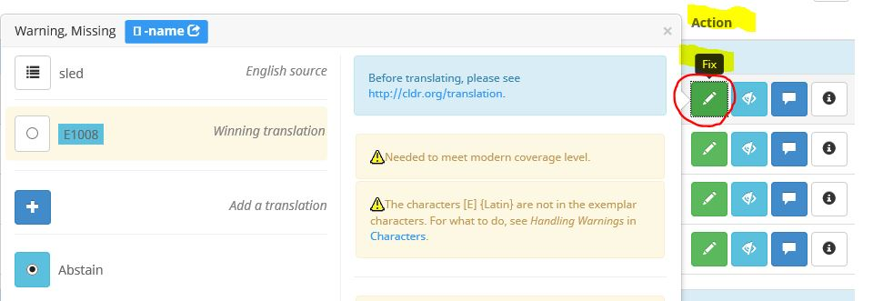
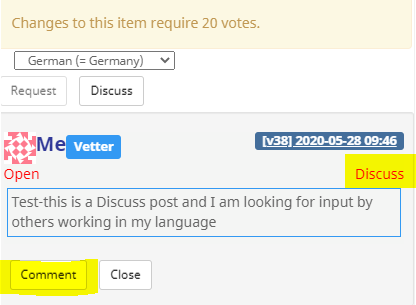
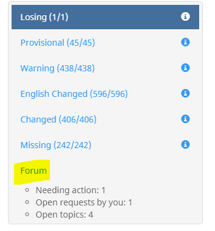

# Survey Tool Guide

---

**[Survey Tool](http://st.unicode.org/cldr-apps/survey) |
[Accounts](../../../index/survey-tool/accounts.md) | [Guide](index.md) | [FAQ
and Known Bugs](../../../index/survey-tool/known-bugs.md)**

---

[TOC]

The Survey tool is a web based tool for collecting CLDR data and includes
various features that the contributors (vetters) should know before getting
started.
Note that the exact appearance in screenshots may change as the tool is enhanced
over time and base on your vetter level.

💡 Helpful Tips

*   Please read the home page of the [Translation
    Guidelines](https://na01.safelinks.protection.outlook.com/?url=https%3A%2F%2Fsites.google.com%2Fsite%2Fcldr%2Ftranslation&data=02%7C01%7Ckristil%40microsoft.com%7C4baf9663933d4ef810b108d4997c81bb%7C72f988bf86f141af91ab2d7cd011db47%7C1%7C0%7C636302207402581433&sdata=VSRRxtOE1hEPjUZF65DgQdriuhhxYQvPGzVedjvYoY8%3D&reserved=0)
    before starting your data contribution.
*   If you experience a **Loading...** problem with the Survey Tool, try
    clearing your browser cache. See [Reloading
    JavaScript](https://nam06.safelinks.protection.outlook.com/?url=https%3A%2F%2Fwww.getfilecloud.com%2Fblog%2F2015%2F03%2Ftech-tip-how-to-do-hard-refresh-in-browsers%2F%23.XOjGNtMzbuM&data=02%7C01%7Ckristil%40microsoft.com%7C3d5791ec423446708bf708d6e0ce2e75%7C72f988bf86f141af91ab2d7cd011db47%7C1%7C0%7C636943573490814084&sdata=zKoAMTCBzsfg8A8XzbUmM88rJ0MJ5RcWdyFPsjzi16M%3D&reserved=0).
*   **Browser support** for Survey Tool includes the latest versions of Edge,
    Safari, Chrome, and Firefox.
*   Use
    [Reports](http://cldr.unicode.org/translation/getting-started/guide#TOC-Reports)
    at the beginning to review the data in your language in a wholistic for Date
    & time, Zones, and Numbers.
*   Capitalization: Translations should be what is most appropriate for
    ”middle-of-sentence” use. So, for example, if your language normally doesn't
    spell languages with a capital letter, then you shouldn’t do that here.
    Please see
    [Capitalization](../../translation-guide-general/capitalization.md) for more
    details.
*   Plurals: For important information regarding the use of plural forms for
    your language, please read [Plurals](../plurals/index.md).

## Vetting Phase

At a point towards the end of Survey Tool period, the Technical Committee will
change the survey tool to "Vetting Mode". In Vetting Mode, submitting new
data/translations is no longer possible, but you can still change your votes and
participate in the forum. (The exception is that you can submit new data if the
currently winning value has generated an error or a warning.)

## Login and Import of old votes

1.  Go to <http://st.unicode.org/cldr-apps/survey/> and log in.

    

2.  **Import of old votes** is automatically handled when you log in for all
    your votes **matching** the latest released data. If you have voted
    previously, upon first log-in, you will see a message showing the number of
    your votes that matched the currently winning votes that have been
    auto-imported.
    Import of your old votes will take some time, but this will be done at 1st
    log-in only.
    {width="400" height="91"}
3.  **Import old votes manually**. You can still import your old voted data that
    **DO NOT match** the last released data.
    1.  Go to Setting (gear icon), under **My Votes**, then **Import Old
        votes**.

    2.  Scroll to the bottom to see the category selection for bulk import.
    3.  Select the categories that you want to import and click **Import
        selected items** button at the bottom.

        

    5.  Go to the data categories in the Survey tool where you have imported
        your old votes, these will show up in the Others column with no votes.
    6.  Review and add your vote. The best practice is to create a forum entry
        explaining why this is the data that should be changed to and drive to
        gain consensus with other vetters.

### Picking Locales

1.  On the left sidebar, you will see the CLDR locale(s). Your default view will
    be the languages you have permissions for. All the locales that you have
    permission to contribute submissions to are marked with PENCIL icon. You can
    view the others but not submit contributions. For example, if you have
    permissions to the default language Afrikaans (af), you will not have
    permissions to Afrikaans (Namibia), and vice versa.

    

2.  Each language is followed by a list of regions that represent specific
    locales. The locale that is grayed out and preceded by an × is the default.
    The others are considered “sub-locales”. If you are working on the default
    locale, select the language name. For example, if you work on Spanish in
    general (default = Spain), you will see that that Spain is grayed out in the
    list below: choosing Spanish means that you are working on the default
    (Spanish for Spain).

    

3.  Only those of you working on a specific variant language (or "sub-locale")
    will pick a non-default region. If you work on Mexican Spanish, pick
    **Mexico**. (This should already be pre-selected for you.)

*Make sure that you haven't mistakenly turned the Information Panel off! See
**[No Information
Panel](http://cldr.unicode.org/translation/getting-started/guide#TOC-No-Information-Panel).***

### Voting view

1.  Once you have selected your locale, more options show up in the left
    sidebar. (You’ll note that the sidebar only shows if you mouse over the
    **>** character on the left.)
2.  If the locale is relatively new and very complete, start working on the
    **Core Data** sectionand go through the rest of the sections. If the locale
    is mostly complete, then go to [**Dashboard**](index.md) below.
3.  Once you have selected a section, you'll see a table to enter votes in. The
    main table has these columns:

    {width="100%" height="auto"}

    1.  **Code**: the code CLDR uses to identify this data point.
    2.  **English**: the plain English value of the data point (the text you are
        to translate).
    3.  **Abstain**: the default vote value for you. Only use abstain if you
        don't know a good value to be used.
    4.  **A**: The value’s current status. A checkmark means it’s approved and
        is slated to be used. A cross means it’s a missing value. (Note, for
        sub-locales, a cross is not necessarily bad. If the parent locale has a
        good value, the sub-locale will inherit it. Check the **Winning**
        column.)
    5.  **Winning**: this is the currently winning value. If the survey tool
        would close now, this is the value we would publish. If the value has a
        blue star next to it, that means it’s also the value that was published
        in the previous version. Normally it takes at least two votes from two
        different organizations to change value: in some locales the bar is
        lower, and for some items it is higher.
    6.  **Add**: If the winning value is not correct and is not listed under
        Others, then use the plus button here to enter the correct value. If you
        enter a new value, your vote will be applied to it automatically.
        *   If what you want is a variation of what is in Winning or Others, you
            can cut & paste, and then modify.
    7.  **Others**: other suggested values, not currently winning, but available
        to vote for.
4.  Click on one of the radio buttons to make your vote. The winning status
    changes in real-time so depending on vote requirements and existing votes,
    your vote may move your desired value to the winning column right away.
5.  Look at the Regional Variants to see if any should be changed: see
    **Information Panel** below.
6.  Once you are done with all the sections, go to the
    **[Dashboard](index.md).**
7.  Under the English column, look for "**i**" for additional information and
    "**e**" for an example.

    {width="320" height="163"}

### Icons

The main panel uses icons to indicate important information and possible
problems. After clicking on the **Code** cell, look to the right-side info panel
for more details.

Icon Description There is a serious error in the translation. There is a warning
on the translation. This might or might not indicate a problem. Hover over this
icon to see important information about translating the item. Hover over this
icon to see an example of the item in context. This is also important for
correct translation. , The item has enough votes to be used in CLDR. , , The
item does not have enough votes to be used in CLDR, by most implementations (or
is completely missing: ) Committee approval is needed for this item. Click the
button in the right-side info panel to request approval. This star label is an
indication referred to as the "**Baseline**". Baseline means that the data was
either the last released data or last modified by the technical committee.

The Winning item is inherited with no vetter votes (This feature is currently
disabled in the Survey Tool).

(Icons for the **Dashboard** are listed in the **[Dashboard
Icons](http://cldr.unicode.org/index/survey-tool/guide#TOC-Dashboard-icons)**
section below.)

### Information Panel

1.  If you hover over an item (including the English item), a tooltip will
    appear showing a sample value and usage of the item in context. The item
    itself will have a white background; other text in context will have a gray
    background.
2.  When you select an item (the text, **NOT** the radio button), additional
    information will show in the right-hand **Information Panel**. See
    screenshot below.

    Make sure you use a wide-screen monitor and enlarge your window until you
    can see it, something like the image below.

    

    The box at the top shows information about the code you are translating. *It
    also has a link that you should click on the first type you encounter that
    kind of item that will explain any "gotchas".*

    If there is an error or warning for the item, you see that in the middle.

    Below that, you'll see an example. This is the same as you get by hovering
    over the item in the center section.

    If there are votes, you'll see a breakdown of them; you also see the number
    of votes required to change the value. Unicode organization members usually
    have 4 votes; others usually 1. Your vote value and the vote value required
    for change will show on the right navigation for the selected item as shown
    in this screenshot (4 and 8 respectively in this case).

    

    Near the bottom, you'll see a pulldown menu that shows the values for
    different regional Variants. Here, you can quickly compare the values and go
    to different sub-locales to correct inconsistencies.

    

9.  You'll also see the New Forum Post button (as shown in the screenshot
    above). This is the easiest way to post discussions for the selected item.
    Remember that the Forum posts are at language level and not at Sub-locale
    level. For more information, see [Forum](index.md).
10. No Information Panel?
    If you click on the **Code** cell and there is no **Information Panel**, you
    may have turned it off accidentally. Go to the Gear icon at the top and make
    sure that the Toggle is set right.

## Inheritance

Some items are by default inherited from other places in the data. You have the
option of voting for the inherited value or entering a different one.

The inherited values are color coded:

1.  Darker  The original is from a parent locale, such as if you are working in
    Latin American Spanish (es_419), this value is inherited from European
    Spanish (es).
2.  Lighter The original is in the same locale, but has a different ID (row).
3.  Red             The original is from the root.

You can click on the link in the right sidebar to see the original value.

**Note:** Voting on inheritance means "always use the inherited value, even if
it changes.” An inheritance vote is advised if there are no differences in
spelling conventions and political relations between your locale and the parent
locale. Voting for inheritance minimizes duplication of data.

### Regional Variants (also known as Sub-locales)

Language variants by Region are differentiated as Parent-locale and sub-locales.
For example,

*   **Spanish es** is the parent (or the default) locale for all Spanish
    locales. Its default content is for Spanish (Spain) es_ES.
*   **Spanish (Latin America) es_419** is one of the sub-locales for Spanish.
    Votes on inheritance will ensure that it will only contain content that is
    different than what is in Spanish.
*   **Spanish (Argentina) es_AR** is one of the sub-locales for Spanish (Lain
    America). Votes on inheritance will ensure that it will only contain content
    that is different than what is in Spanish (Latin America)

The regional variants menu for a data point is shown on the right navigation
information pane. It will look something like the following (the exact
appearance depends on the browser).

When you pull it down, it will show which regional variants have different
values than the main language locale. The current locale will show as darker
gray as shown in this screenshot below.

In the example in the screenshot above, Switzerland and Liechtenstein have
different regional data than German (=Germany). Hover over the menu item to see
the value it has. In the above diagram, you'll see "." as the decimal separator
for Switzerland in the yellow hover box above as shown in the screenshot above.

If any values are incorrect, please correct them. You can do that by selecting
the menu item, which will take you to the same item, but in the regional locale.
For example, selecting “Belgium” above goes to the decimal separator for *German
(Belgium)*. You can then correct the item.

Normally, the only values that should be different are in date and number
formats. In some locales there are other variations: for example, German
(Switzerland) spells words with “ss” instead of “ß”, so differences can occur on
many different pages.

### Regional Inheritance

If you are voting in in a sub-locales such as en_AU, es_MX etc.. you have two
options on how you vote:

    a vote to actively follow whatever the translation is for the locale you
    inherit from. You do this by voting for the translation highlighted in blue
    box. When you do this, you are essentially saying "**always use the
    inherited value, even if it changes in the source parent value**". Only vote
    for the blue value if you feel confident the parent value will always be
    suitable for your locale. In the screenshot below, this is the case for the
    vote for "inglês".

    vote for a firm value in your locale, that should *not* follow the parent
    locale. You do this by simply clicking the plus button and enter the value
    you want. This could be the same value as what is currently being inherited,
    but this shows that your locale should not change with the parent value.
    When you do this, you'll notice after your vote that the value is not
    highlighted in blue, indicating it's a hard vote, as in the case of "embu"
    shown in the screenshot below in the Winning column.

The vote status column will show an orange-up arrow
() if the winning item is inherited and it does not
have any votes.

**Importance of Voting for inheritance (option 1 above)**

An inheritance vote is useful if there are no differences in spelling
conventions and political relations between your locale and the parent locale.
Abstaining from voting may have the same effect, but if another vetter votes for
something different, your Abstained vote means that it's not opposed by you;
thus, your intention is not known to others. By voting for the blue inheritance
value you make your opinion known to other vetters.

*   Inheritance is important, to prevent data duplication.
*   Inheritance is not only limited to “sub locales”. Parent locales (or default
    language locales) also have inheritance from either other fields or the
    root.
*   By default, all data are inherited if there are no contributions. The data
    are indicated as Missing or Abstain. Sub-locales have inherited values that
    are generally from the parent locale (e.g. de_CH will inherit values from
    de_DE).
*   The inherited values appear in the **Others** column highlighted in blue box
    (e.g. “embu” and "inglês"). By clicking the radio button in front of those
    values, you are voting for inheritance.
*   If the inherited value is not correct for your locale or it’s likely for
    your locale to change the data in the future, click the + button, and enter
    a new suggestion (this is considered as a hard vote and will be retained as
    the value for the sub-locale even if the value in the parent-locale changes
    ).

## **Dashboard**

The Dashboard will show you a list of data items with warnings of different
kinds. Some will require action, some may be false positives. (For the veterans,
this is the redesigned Priority Viewer.)

The goal is that you should work the Dashboard down to show zero items, then
review the
**[Reports](http://cldr.unicode.org/index/survey-tool/guide#TOC-Reports)**,
below.

*The first priority is to fix all the **Missing** items by supplying the correct
translations.*

### Dashboard Reports

Go through each of the sections to address the problems. These sections are
explained below.

At the top of each section is an arrow symbols to show the items in the section,
the title (such as **Missing**), the number of items, and an "Unhide" button.
Below that header are a series of rows.

### Dashboard Columns

There are five columns in the Dashboard view.

    **Code**: this links to the field in survey tool. Click on it to go to the
    item in the Survey Tool.

    **English**: this is the English value

    **CLDR *XX***: The previous version’s value. In the below screenshot, this
    is indicated as **CLDR 31**

    **Winning *XX***: The currently winning value. In the below screenshot, this
    is indicated as **Winning 32.** If the currently winning value and previous
    version’s value are equal, then the winning value is shown with “=”.

    **Action**: There are 3-4 action buttons, as shown in the screenshot below
    on the right.

### How to handle different categories

Following are guidelines on best practices for handling items under each
category in Dashboard.

    #### Missing

> These are items where there is no localization provided by any contributor.
> Click on the blue Code on the left (such as **Famagusta** in the screenshot
> below). It opens a new window with the survey tool where items are highlighted
> and you can add a translation. When you fix a **Missing** item it will turn to
> **~~New~~ Changed**.

> {width="1332" height="443"}

    #### **Losing**

> These are items that you already voted on. This indicates that your vote is
> not for the currently winning value. If you can live with the winning item—if
> it is reasonable, even if you don't think it is optimal—change your vote to be
> for the winning item. If not, click the **Forum** button and give reasons for
> people to change their vote to what you have suggested. If not all users have
> voted yet, these values may still be approved before the end of the cycle.
> **Engage with others on the Forum discussions**. Make sure to post the reasons
> why others should change their votes and **respond to others’ posts**. You can
> list a number of items in the same forum post, to make it easier for people to
> read.

> 

    #### **Disputed**

> This is very similar to **Losing**, except in this case your vote is winning
> and someone else's is losing. Review all of the items to see if someone else’s
> item is better and read the forum post, and whether you want to change your
> vote. Discuss in the forum, then use the Hide button to hide disputes you’ve
> addressed in the forum.

    #### Changed

    (The label was **New** until CLDR v37 version of the survey tool)

    Changed count is provided in the Dashboard only as a reference.

> The ~~New~~ Changed items are either:

    *   Missing items now have a value.
    *   The Winning value of the translation has been changed.

    #### English Changed

> These are items where the English source has changed. You need to re
> re-checked in order assess the impact to your language and update as
> appropriate.

    #### Warnings

> These are issues which appear after automatic checks. (For examples, a message
> could be "*The value is the same as English"*, which is a quite common warning
> for languages that are close to English in the spelling of languages or
> territories. If the value is actually ok, then click on the Hide button
> (crossed eye). If not, then vote for a fix, or post on the Forum for
> discussion.

> 

### Dashboard icons

Icon Description **Code**: This will bring up a new main window with the context
for the item, where you can make changes. **Fix**: This will bring up a Quick
Fix Panel where you can change or edit your vote (see below). **Hide**: If you
are sure that the warning is a false positive, you can hide it from view. Click
on the other eye button on top of the section to unhide hidden lines. **Forum**:
Enter a forum post to be seen by other linguists regarding this specific item.
This is useful if your item is losing and an incorrect item is about to win.
Also use the forum to discuss the translation with other vetters. **Info**:
Warnings or errors will have additional info here.

### Quick Fix Panel

If you click on the Fix button, you'll see a pop-up **Quick Fix Panel** like the
following.

This Action panel on the right shows a summary of what you'd see in the main
page for the item, and allows you to make a quick change. If, however, you
haven't changed an item of this type before, it is best to click on the link at
the top to go to the main page for the item. That way, you can see other items
of the same type.

### Dashboard Summary

There are two ways to clear items from the **Dashboard** list:

1.  fix them (such as adding a translation for a missing item)
2.  hide them (such as when the English has changed but the translation doesn’t
    need to change).
    *   ***Only** hide items if it really is a false positive, **not** because
        you gave up on fixing it…*
    *   *If you hide an item by mistake:*
        *   *Unhide all the lines with the top eye button.*
        *   *Click on the orange eye button in the line (a “Show" tooltip will
            appear).*
        *   *Hide all the lines again by clicking the top eye button.*

## Reports

The reports show lists of items that need to be reviewed for consistency. You
should look through these after you do the **Dashboard** to make sure that the
items are consistent, when viewed in the context of others. Each of them has a
link to instructions at the top. Please read these before continuing.

Reports are under the left navigation.

Reports are a good way to review the data in your language in a wholistic view
for the Date and time, Zones, and Numbers.

{width="226" height="320"}

*Example:*

**

## Special cases

**You may not make changes to this locale**
You may see a message like the following when trying to modify a regional
locale, like pt-BR.

 →

> The reason that Brazil is grayed out is that it is the default content locale
> for Portuguese. So to modify pt-BR, you need to simply click on Portuguese. If
> you do click on Brazil, you will get to a page with the following at the top.
> Clicking on [default content
> locale](../../translation-guide-general/default-content.md) will explain in
> more detail.

{width="400" height="56"}

### 20 vote items May not be modified

Some items have change protection in place that will stop vetters from changing
it, but you can still advocate a change. This is indicated by the message "May
not be modified-see details" as shown in the screenshot below, or that the
threshold for changing the value is 20 votes, instead of the usual 8 or 4. This
indicates that the item is particularly sensitive to data instability and has a
broad impact. Changes to these items require Technical Committee review. To
suggest a change, you have to "flag" the value.

To change it, you have to flag the item for committee review:

1.  Click on the “**Flag for Review button**”.
2.  On the new page, you'll see a message box.
3.  Enter the change that you want to make, and add a justification for changing
    it.
4.  Then click **“Post**”.
5.  Towards the end of data collection cycle, the Technical Committee will
    review the change request and either accept it, or reject it with comments.

Note: The **Flag for Review** button will be available only when the item has a
20 vote value AND there is a suggestion in the **Others** column.

## Forum

Forum is the place to discuss and collaborate with other vetters on questions
and issues in your language. The forum is at Language level and not at
sub-locale level; if you are talking about a translation in a sub-locale, be
sure that you are clear about that.

It's a best practice to **create a Forum post whenever you propose a change to a
previously approved value**, and provide an explanation and links to references.

### Forum Etiquette

While creating New Posts on Forum or participating in discussions please follow
these general etiquette guidelines for best productive outcomes:

*   Be professional. Provide accurate, reasoned answers so that other
    participants can easily understand what you are talking about.
*   Be courteous. Refrain from inappropriate language and derogatory or personal
    attacks.
*   Don’t “SHOUT”; that is don’t use all capitals.
*   In case of disagreement, focus on the data and provide evidence to support
    your position. Avoid challenges that may be interpreted as a personal
    attack.
*   Be prepared to have your own opinions challenged or questioned, but don’t
    take answers personally.
*   It’s possible that participants have different expectations on the intent of
    the data. Clarify what you think is the intent may help especially if
    disputes continue.
*   Remember that open discussion is an important part of the process; abiding
    by these guidelines will encourage active participation by all vetters and a
    better end result.

### **Forum Workflow**

Forum posts work with the following workflow:

1.  Create a new **Request** or **Discuss** post.
2.  Responses by other vetters in your language with Agree, Decline, or Comment.
3.  Once resolved, those who created the initial Request or Discuss closes the
    post.

### How to create a new forum post

A forum post can be specific to a particular data point or a general issue. In
either case, create a new forum post to an item.

*   A post that is specific to a particular data point.
*   A general issue that impacts multiple data points. In a general case that
    impacts multiple data points, you do not need to post new forum posts for
    every item impacted. The general issue should be flagged to other vetters
    and once a consensus is reached, it is expected that vetters update their
    votes on all impacted items. New forum posts can be used to flag to other
    vetters if others fail to update their votes on all impacted items. ONLY
    request if others have missed or have not updated consistently.

**Create forum posts from the [Information
pane](http://cldr.unicode.org/translation/getting-started/guide#TOC-Information-Panel)
in the voting window.**

1.  Vote on an item (or add new +) for the item you want to suggest changing.
2.  In the Information pane on the right, there are two buttons to indicate the
    type of forum posts:
    1.  **Request** You have voted on a non-winning item, and you want to
        Request others to change their votes.
    2.  **Discuss** You have not created a new suggestion, and want to bring up
        a question regarding the winning data. The discussions here may turn
        into a new Suggestion and a Request for change.
3.  Click **Request** OR **Discuss** button and fill out the details of your
    request. (Note: The **Request** button is disabled unless you have voted)

    {width="400" height="173"}

    *   **Request**
        1.  A precomposed text is included to help start your post.
            **Important!: Request works WITH the item you voted for currently.**
            *Please consider voting for “{your voted-value}”.* My reasons are:
        2.  Complete the text by filling out your reasons and links to
            references.
        3.  Then **Submit.**
    *   **Discuss**
        1.  Post your questions for other vetters, including links to
            references.
        2.  Then **Submit**.

            

### Responding to Request posts

There are two ways to respond to forum posts:

*   Information pane (This is the recommended option.)
*   In the Forum view (See [Working in the Forum
    view](http://cldr.unicode.org/translation/getting-started/guide#TOC-Working-in-the-Forum-view-))

**Respond from the [Information
pane](http://cldr.unicode.org/translation/getting-started/guide#TOC-Information-Panel)
in the voting window.**

In the **information pan**e, select the button that applies to your decision:

*   Three response buttons are available for you**: Agree**, **Decline**,
    **Comment**
*   Each posted response is labeled in Red and its response type: Agree, Decline
    or Comment.

**Choosing your Response:** Agree, Decline, or Comment

1.  **Agree** If you agree with the reasons for change, you don't need to add more explanations for agreeing.A precomposed text is included to help start your reply:
    I agree. I am changing my vote to the requested “{requested-value}”

    

2.  An **Automated** ***Agreement*** will be posted if you vote for the
    requested value. Your agreement will be automatically posed with a
    precomposed reply: I voted for “{requested-value}”

    {width="320" height="250"}

3.  **Decline:** Use this option if you absolutely DO NOT agree with the post. A
    precomposed text is included to help start your reply: I decline changing my
    vote to the requested “{requested-value}”. My reasons are: <Please add your
    reason with reference links>

    

4.  **Comment:** Use this option if you do not Agree or Decline, and you have
    other input to bring to the discussion or if you want to ask for more
    information.

### Responding to Discuss posts

There are two ways to respond to new forum post:

*   Information pane (This is the recommended option.)
*   In the Forum view (See [Working in the Forum
    view](http://cldr.unicode.org/translation/getting-started/guide#TOC-Working-in-the-Forum-view-))

**Respond to forum posts from the [Information
pane](http://cldr.unicode.org/translation/getting-started/guide#TOC-Information-Panel)
in the voting window.**

1.  In the information pane, click the **Comment** button and add your input to
    the open discussion.
2.  The label **Discuss** in Red indicates that this is a Discuss post (to
    distinguish from Request posts)

    {width="400" height="293"}

### Working in the Forum view

In the Survey Tool [Forum](https://st.unicode.org/cldr-apps/v#forum/USER//)
view, there are multiple filtering options available for you to work more
effectively.

1.  The Forum view can be accessed from the left navigation **Forum.**

    

    By default, the filter is for **Needing action**.
    Filter options:

    *   **Needing action**: Forum posts included in this filter are Requests and
        Discussion posts by someone in your language. You have not yet taken
        action on either agreed or declined or posted a discussion asking for
        additional information. For Discussion posts, these are where you are
        not the last poster.
    *   **Open requests by you**: Forum posts included in this filter are
        Requests that you have posted that you have not closed yet.
    *   **All Open topics**: All posts that are open. This includes both Request
        and Discussions that have not closed yet.
    *   **All topics:** All topics, open or closed, including forum posts from
        previous releases.
        Note that Forum posts that were active in previous releases will be
        marked as Closed at the start of a new Survey tool cycle.

**Respond to forum posts in the Forum view**

In the Forum view, you can respond to Request and Discuss posts.

For **Request posts**, you can select your decision using the 3 available
buttons: **Agree, Decline, Discuss.**

See [Responding to Request posts in Information
Pane](http://cldr.unicode.org/translation/getting-started/guide#TOC-Responding-to-Request-posts).

For **Discuss posts**, you can use the Comment button to add your input.

### Forum posts in Dashboard

#### **Count of open posts**

In the Dashboard, a count of open forum posts are available for you to know the
work remaining in the Forum.

*   **Needs action**: These are open posts that you have not responded to yet.
    Please go to the item and select one of the buttons in the Information pane.
*   **Open requests by you**: Please watch replies by others and close the
    thread once there is consensus. It is expected that you Close threads at the
    end of the cycle.
*   **Open topic**: This is provided as information as to how many forum posts
    are still open in your language.

{width="298" height="320"}

**Note:** For Survey Tool users who manage other user's profiles for their
organization, you will not yet see a summary view of open threads for all
locales. You will need to look at individual locale Dashboard. \[Tracking
ticket; [CLDR-13616](https://unicode-org.atlassian.net/browse/CLDR-13616)\]

#### **Respond to posts from the Fix view**

The Fix popup in Dashboard is a quick way to fix simple changes.

For full context and better decision making, it is recommended that you [work in
the Information
pane](http://cldr.unicode.org/translation/getting-started/guide#TOC-Responding-to-Request-posts)
in the voting view.

See [Responding to
Request](http://cldr.unicode.org/translation/getting-started/guide#TOC-Responding-to-Request-posts)
and [Responding to Discuss
](http://cldr.unicode.org/translation/getting-started/guide#TOC-Responding-to-Discuss-posts)in
the Information pane in the voting view.

**Email notification**

1.  Another way to check for posts that may need your attention is to review
    email notifications to the e-mail account for your locale. You can delete
    these notifications if they are for changes initiated by you. You can open
    the post directly from a link in the email.
2.  When you make a forum entry, it will be emailed to all other linguists
    working on locales with the same language, parent or sub-locale (i.e.
    **forum is at Language level and not at sub-locale level**). If you are
    talking about a translation in a sub-locale, be sure that you are clear
    about that.

### Forum posts for CLDR ticket feedback

CLDR users can send in data feedback using
[JIRA](http://cldr.unicode.org/index/bug-reports). Tickets filed in JIRA will be
processed as described below. Please expect to see posts by CLDR Technical
Committee members (TCs) in Forums, and participate by providing your response to
any tickets needing your input.

The goal is to bring it to the attention to all linguists contributing in a
particular language, and gather their input, so an informed decision can be made
and/or suggested.

1.  CLDR TC members accept JIRA tickets.
2.  For each ticket assigned to them, the TC member will post a forum topic in
    each language mentioned in the ticket, asking for vetters to look at the
    issue and either make the requested change, or explain in a forum post why
    changes should not be made.
3.  A reason for not changing could be for example that it is a reasonable
    change, but doesn't exceed the 'stability' bar in the translation
    guidelines.
4.  TC members will monitor the forum discussion/change during the Submission
    phase, and will close the JIRA ticket after the forum discussion is
    concluded.

### ~~Old Forum Posts~~

**Note: The Old Forum posts are now integrated into the single Forum view.**

~~Forum posts from the most recent Survey Tool release can be accessed using the
Old Forum Post navigation in the left-navigation pane.~~

~~(This is a new feature introduced with CLDR v32 data collection, May 2017.)~~

~~~~

~~There are a few known limitation that you should know:~~

*   ~~The old forum posts are not linked **from** individual items or the
    current Forum. But it but you can navigate **To** the item from the old
    post.~~
*   ~~The old forum posts are only from the most recent data collection release.
    For example, if you are contributing to CLDR v32, the old forum posts are
    discussions from CLDR v30.~~

**~~When to use the Old Forum Posts~~**

~~Here are a few sample cases when you may want to use the Old Forum Posts:~~

*   ~~If you remember posts in the last contribution period, and you want to
    refresh your memory.~~
*   ~~If you don’t agree with the current Approved item, and you want to see if
    your new suggestion was already discussed in the last period.~~

**~~Ways to use the Old Forum Posts~~**

~~Here are a few tips for using the Old Forum posts:~~

*   ~~Search for the item using the browser search feature (CTRL+F)~~
*   ~~Search for your profile name, the Term, or the data category path (For
    example, Currencies)~~
*   ~~Click on the **Item** link on the right side of the post to go to the item
    directly. The item will take you to the current version of the data.~~
*   ~~Click on **Reply** to continue the thread. This action in the Old Forum
    Posts will post a new thread in the current Forum. Go to **Forum** to see
    your post of the reply. Your reply will not be shown in the Old Forum Posts
    even though you initiated the Reply there. This ensures that your thread
    will be captured for the current release.~~
*   ~~The last TC user action on a thread typically means that it was discussed
    by the committee, and actions were taken to resolve errors. This does not
    mean that you can reactivate the discussion if you do not see a resolution
    on discussions among linguists.~~

## Advanced Features

1.  Users familiar with CLDR XML format can upload votes (and submissions) for
    multiple items at once. See **[Bulk Data
    Upload](../../../index/survey-tool/upload/index.md).**
2.  Organization managers can manage users for their organization (add, remove,
    send passwords, set locales, etc.) For more information, see **[Managing
    Users](../../../index/survey-tool/managing-users/index.md).**

    Some users may want to reset their Coverage Level, with the menu that looks
    like the image to the right.

    The Coverage Level determines the items that you will see for translation:
    the minimal level has the highest priority items. You normally start with
    the level marked "Default" (which will vary by your organization and
    locale). Each successively higher level adds more items, at successively
    lower priorities. You will not normally go beyond "Modern", unless you have
    special instructions for your organization.

    *Note that some companies won't use the data until it is complete at a
    certain coverage level, typically **Modern**.*

## Reporting Survey Tool issues

If you run into a problem with the Survey Tool functionalities, please see [FAQ
& Known Bugs](../../../index/survey-tool/known-bugs.md) to see whether it has
already been reported (and whether there is a work-around). If not, or if you
have suggestions for improvements, please file a bug using the Feedback link at
the bottom of each window. If you encounter problems or have enhancement
suggestions for the survey tool, please [file a
ticket](http://unicode.org/cldr/trac/newticket).
