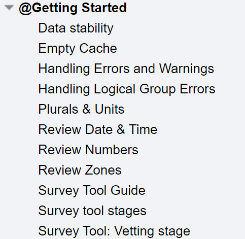

# @Getting Started

Before getting started to contribute data in CLDR, and jumping in to using the
Survey tool, it is important that you understand the CLDR process.

1.  Understand the basics about the CLDR process and the community-based model
    and the Technical Committee. Read: <http://cldr.unicode.org/index/process>
2.  Read the Getting Started topics on the Information Hub
    <http://cldr.unicode.org/translation>

    {width="200" height="195"}

3.  Use the Survey Tool smoketest environment to get hands on learning of the
    tool: Survey Tool [TEST
    Environment](https://cldr-smoke.unicode.org/smoketest/createAndLogin.jsp?vap=pXOmD5A9v).

\*If you (individual or your organization) have not established a connection
with the CLDR technical committee, start with [Survey Tool
Accounts](../../index/survey-tool/accounts.md).
