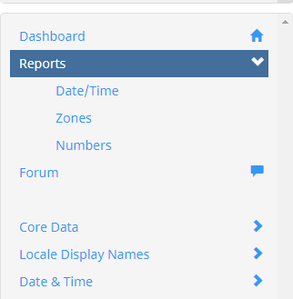
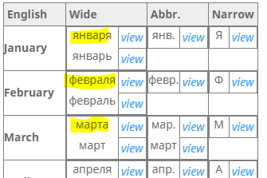
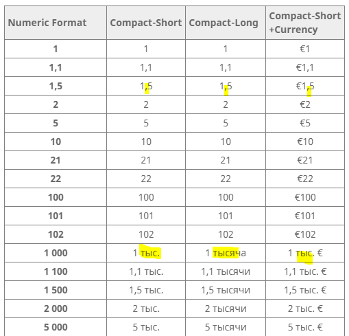
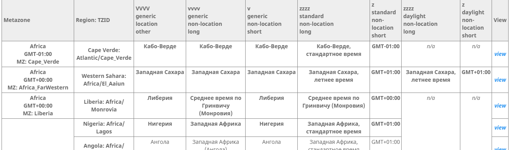

# Review Reports

[TOC]

The three Review Reports in the survey tool provide a great to review the data
holistically before getting started.

1.  Date/Time
2.  Numbers
3.  Zones

## Using the reports

The benefits of using the Reports include:

1.  Get familiar with the CLDR data.
2.  Review the correctness of the latest data.
3.  These reports are composition of number of different fields in CLDR data,
    and they will give you a better idea of how different data fields impact one
    another.

To get started, in the Survey tool, open the **Reports** from the left
navigation.

{width="313" height="320"}

## General Tips

1.  Review the full report at the beginning of a contribution cycle.
2.  Review the full report again at the end of the contribution cycle.
3.  Scan down the **Native Examples** column to see that they are correct
    representations of the English, and that they are consistent across rows.
4.  To correct the data, use the **View** links on the right of each line in
    Reports to go directly to the field and correct the data.
5.  The following should be dot-separated, not dash.

Past examples of problems

1.  Consistency between different forms by looking at them side by side.
2.  If your language does not make a grammatical distinction, there should not
    be two rows showing the standalone and formatted.
3.  The casing is inconsistent; (e.g. some months are capitalized and others are
    lower cased). see. capitalization rule.
4.  Spelling consistency.
5.  Use of hyphens in some rows, but not in others. (For example, Zone names
    with city names using hyphens and other city names without hyphens)

## Date & Time Review Tips

1.  Even if your language preference is to use the 12 hour format, it's
    important to also pay attention to the **Times 24h** section. In
    applications using CLDR data, users can set their preference to 24 hour
    formats.
2.  Lower down on the page are charts of weekdays, months, and quarters for
    review. When a language has two different forms depending on format vs
    stand-alone, there will be two rows for the same item. Russian, for example,
    uses the genitive for format (top row, highlighted in yellow in the
    screenshot), and the nominative for stand-alone (second row).

    {width="320" height="213"}

## Number formats Review tips

1.  Each forms should be acceptable for your locale.
2.  Review the cells within each row for consistency
3.  Also look for consistency across the rows for consistency.
4.  Check that each cell has the correct plural form. (some languages, don't
    exhibit plural forms)

{width="320" height="307"}

## Zones Review tips

1.  The first two columns identify the timezone (metazone)
2.  Compare the items in each row for consistency.
3.  Compare the items in the same column across different rows.
4.  City names that use hyphens do not show the hyphens in patterns because they
    are constructed from the city name and the pattern {0} Zeit. Consider
    whether it would be better to always remove the hyphens, or to add them to
    the pattern {0}-Zeit.

