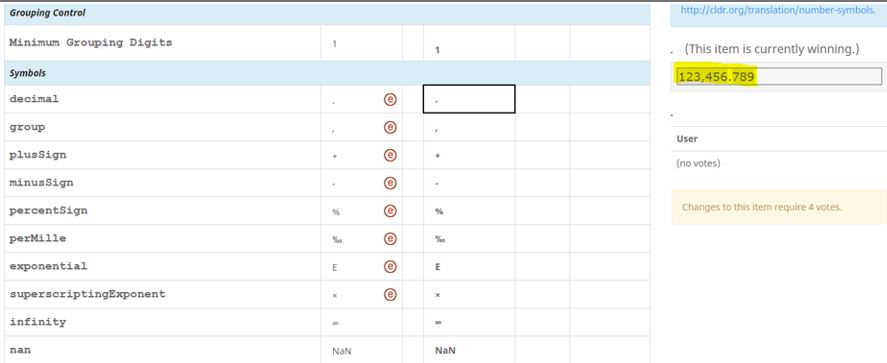

# Number Symbols

The following symbols are used to format numbers. The Approved symbols for the
locale will be substituted for the placeholders described in [Number
Patterns](../number-patterns/index.md).

For English regional locales (e.g. en_DE) where English is not the primary
language of the country/region (e.g. en_DE; English as used in Germany), the
number formats and date formats should follow the **English formatting usage**
in that country/region. Often, the formatting usage in English tend to follow
the British or American formatting rather than the formatting of the primary
language. Consult with the English versions of prominent magazines or newspapers
for guidance on date and number format usage.

Name English Example
Meaning decimal 2,345.67
decimal separator group 2,345.67
grouping separator, typically for thousands plusSign +23 **\***

the plus sign used with numbers

minusSign -23 **\*** the minus sign used with numbers
The + and - symbols are intended for unary usage, and not for binary usage;
therefore, the + and - symbols represents either the positive number or a
negative number. For example, in an operation 3 -(-2), the defined symbol would
be used for the second minus sign, but not for the subtraction operator. Any
directionality markers needed (e.g. <LRM>) to keep with the number should be
included. percentSign 23.4% \* the percent sign (out of 100) perMille 234‰ \*
the [permille](http://en.wikipedia.org/wiki/Per_mil) sign (out of 1000)
exponential 1.2E3 \* used in computers for 1.2×10³.
superscriptingExponent1.2×103 **\*** human-readable format of exponential
infinity ∞ **\*** used in +∞ and -∞. nan NaN **\*** "not a number".
timeSeparator2:33 PM This symbol is currently **==*not used*==** for anything
(and is only visible in SurveyTool at comprehensive level) but may be retrieved
by CLDR data consumers. It should match the time separator symbol actually used
in [Date/Time Patterns](../../date-time-1/date-time-patterns/index.md).

💡 Helpful Tips

*   The symbols marked with \* (in the 3rd column) in the above table typically
    do not need to be changed for other languages.
*   Review the examples in the Survey Tool on the right-side pane to ensure that
    all pattern and symbols are as expected. (Shown in the screenshot below)
*   The winning symbols in your locale are used in the Number Format examples.
    Please complete the [Number
    Symbols](https://st.unicode.org/cldr-apps/v#/ja/Symbols/) before working on
    [Number Formatting
    Patterns](https://st.unicode.org/cldr-apps/v#/ja/Number_Formatting_Patterns/).

